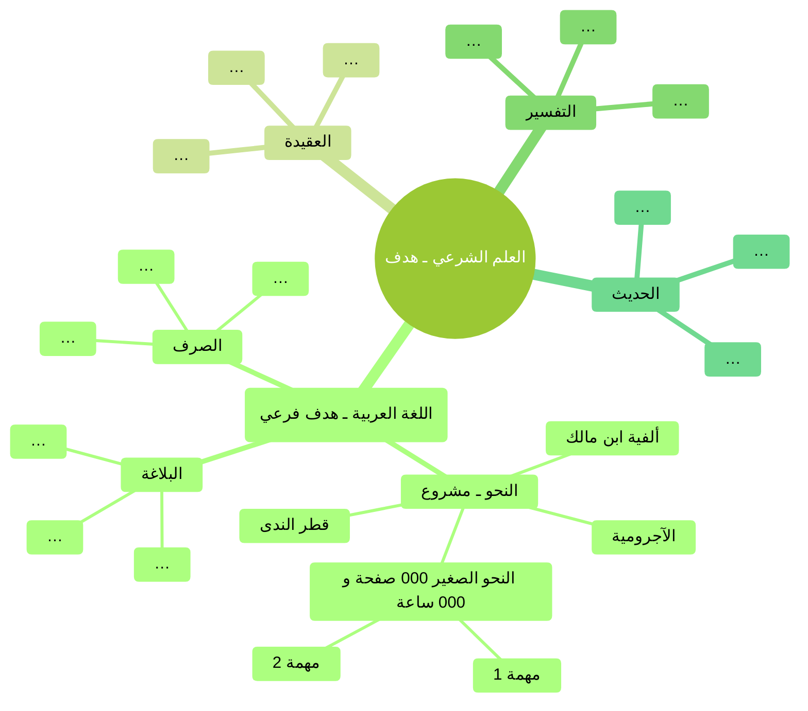

الحالة:: #مصدر/معالج  
النوع:: #مصدر/صوت  
اﻷولوية:: 2  
الغرض:: الإنتاجية  
المنشيء:: [[لطفي أحمد الطوخي|لطفي أحمد الطوخي]]  
المدة:: 00:36:12  
الرابط:: <https://t.me/E3adettashgheel/320>  
المعرفة:: [[التخطيط واﻹنتاجية|التخطيط واﻹنتاجية]],  
التدريب:: #مساق/إعادة_تشغيل_الذات ,  
المؤثر:: ,  
تاريخ اﻹكمال:: [[2023-11-02|2023-11-02]]

[إعادة تشغيل الذات - تحديد الطريق - كيفية الوصول](https://t.me/E3adettashgheel/320)

---

## مقدمة

- في [[./إعادة تشغيل الذات - مقدمة وتصور عام لمحور وضع الأهداف والتخطيط#ماذا سنتعلم؟|مقدمة المحور]] ذكرنا أنه نحتاج ثلاث خطوات لوضع الأهداف والتخطيط:
	1. [[./إعادة تشغيل الذات - كيف أحدد أهدافي؟ تحديد نقطة الوصول|تحديد نقطة الوصول (الأهداف)]].
	2. تحديد الموقع الحالي، وإمكانات نفسي. (محور فقه النفس و[[./إعادة تشغيل الذات - معيقات ومعينات الطريق|معيقات ومعينات الطريق]])
	3. تحديد الطريق وكيفية الوصول وتحقيق الهدف. (هذه الصوتية)

- هدف الصوتية تكوين بعض المفاهيم والتصورات، والتطبيق العملي المفصل لاحقًا.
- سبق وقلنا أن سؤال الكيفية أسهل من سؤال الغاية (لماذا) والماهية (ماذا).
- الهدف المرحلي وسيلة وليس غاية.
- تحديد ماهية الهدف بوضوح يساعد على حسن اختيار الخطة.

## فرقٌ بين الهدف والخطة، وبعض التعريفات

### تعريف الهدف

- الهدف: المكان النهائي الذي أريد أن أصل له بعد فترة زمنية معينة.

### تعريف الخطة، والعناصر المهم توافرها فيها

- الخطة: الخطوات العملية تنفيذية للوصول للهدف.
- لابد أن يتوفر فيها عدة أمور:
	1. واضحة ومحددة.
	2. قابلة للتنفيذ.
	3. مقسمة لمراحل.
	4. تحتوي على تفاصيل وكميات الأمور المطلوب عملها (قابلية الحصر).

### تعريف المشروع

- المشروع: مجموعة من المهام لها مواعيد بداية ونهاية محددة، وهو وحدة أصغر من الهدف.

### تعريف المَهمَّة

- المَهمَّة: أصغر وحدة بنائية للمشروع، وتكون قابلة للتنفيذ بشكل مباشر وعادة في فترة زمنية قصيرة.
- كلما قسمنا المشروع إلى مهام أصغر كلما كان أفضل وكنا أقدر على تنفيذه.

## مثال (طلب العلم الشرعي)

- تحديد القصد. ما هو العلم الشرعي أصلا؟
- بالبحث والقراءة واﻹطلاع يبدأ التصور بالتشكل عبر المعلومات، وتظهر تقسيمات فرعية للأمور (علوم آله وعلوم غاية).
- بعد تسجيل الأهداف الفرعية نبحث عن كيف نتعلم كل منها ومراحل التعلم ونسأل أهل الخبرة.
- في كل هذف فرعي ستظهر مشاريع، مثلا في تعلم اللغة العربية عندنا النحو والصرف والبلاغة.
- في كل علم شرعي هناك مراحل للدراسة، ومرحلة التأسيس لا بد من المرور عليها في كل العلوم، ثم مرحلة التخصص.
- الخرائط الذهنية مهمة في تخطيط الأمور المتشعبة.
- خلاصة التقسيم:
	- هدف
		- هدف فرعي
			- مشروع
				- مَهمَّة

## وَمَضات

- المنهجيات وإن اختلفت في الغالب تؤدي لنفس النتيجة، وتتفق في النسبة الأكبر طالما من وضعها متخصص.
	- لا تعتمد أول منهجية تجدها في البحث، بل اطلع على أكثر من واحدة وأحصى المكرر منها والمجمع عليه وأبدا به والباقي سيأتي في الطريق.
	- لا تضيع وقت طويل في المنهجيات.
- قد لا تستطيع وضع تفاصيل كل خطوة من الهدف، فيكفيك وضوح مهام الخطوة الأولى من كل هدف، وإن كان الأكمل والأفضل وجود التصور العام للطريق حيث سيفيد في تقدير الإنجاز والتقدم.

> عَنْ أَبِي هُرَيْرَةَ رضي الله عنه قَالَ: قَالَ رَسُولُ اللهِ ﷺ: «الْمُؤْمِنُ الْقَوِيُّ خَيْرٌ وَأَحَبُّ إِلَى اللهِ مِنَ الْمُؤْمِنِ الضَّعِيفِ، وَفِي كُلٍّ خَيْرٌ **<u>احْرِصْ عَلَى مَا يَنْفَعُكَ، وَاسْتَعِنْ بِاللهِ وَلَا تَعْجِزْ</u>**، وَإِنْ أَصَابَكَ شَيْءٌ فَلَا تَقُلْ: لَوْ أَنِّي فَعَلْتُ كَانَ كَذَا وَكَذَا، وَلَكِنْ قُلْ: قَدَّرَ اللهُ وَمَا شَاءَ فَعَلَ فَإِنَّ لَوْ تَفْتَحُ عَمَلَ الشَّيْطَانِ.»  
> [صحيح مسلم - ط التركية ٨/‏٥٦ — مسلم (ت ٢٦١)](https://app.turath.io/book/711?page=8097)

- "احْرِصْ عَلَى مَا يَنْفَعُكَ" أنت قبل غيرك، وتعرف ذلك من خلال معرفة نفسك أولًا والموارد المتاحة لك.
	- لا تدخل برنامج طويل المدى إلا وأنت تعرف مكوناته ومراحله كلها حتى تعرف مدى ملائمته لك (البناء المنهجي حاليًا يعيبه هذا الأمر).

- مهم أن أعرف في كيفية الوصول جزء الصفات والسمات والعقلية المطلوبة لتحقيق الهدف.

## تكليف وخاتمة

- سيكون التطبيق العملي فيديو إن شاء الله.
- التكليف:
	- تقسيم الحياة إلى جوانب وأقسام.
	- تحت كل قسم نحدد الأهداف كما ذكرنا.
	- اختر هدف واحد وطبق عليه المعرفة المكتسبة في هذه الصوتية.
