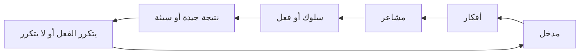
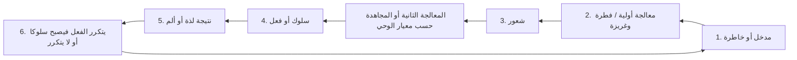

الحالة:: #مصدر/معالج  
النوع:: #مصدر/صوت  
اﻷولوية:: 2  
الغرض:: الإنتاجية  
المنشيء:: [[لطفي أحمد الطوخي|لطفي أحمد الطوخي]]  
المدة:: 01:14:10  
الرابط:: <https://t.me/E3adettashgheel/224>  
المعرفة:: [[التخطيط واﻹنتاجية|التخطيط واﻹنتاجية]],  
التدريب:: #مساق/إعادة_تشغيل_الذات ,  
المؤثر:: ,  
تاريخ اﻹكمال:: [[2023-08-10|2023-08-10]]

[إعادة تشغيل الذات - كيف يتشكَّل السلوك؟](https://t.me/E3adettashgheel/224)

---

## مقدمة

- الانطلاق من النِّظْرة الإسلامية للأمور وليس المدارس الغربية.

- **السلوك:** طريقة التصرف في الأمور المتكررة اليومية.

  - هل أنت عصبي / هادئ / ملتزم / مسوف / مماطل / كسلان / عادات النوم / الأوراد / شكل اليوم العام / الطعام / إلخ.

- السلوكيات وأفعالك متراكمة على بعضها هي التي تشكلك كشخص.

> (إنما العلمُ بالتَّعلُّم، و إنما الحِلمُ بالتَّحلُّمِ، و من يتحرَّ الخيرَ يُعطَهْ، و من يتَّقِ الشرَّ يُوَقَّه)  
> الراوي: أبو الدرداء وأبو هريرة | المحدث: الألباني | المصدر: صحيح الجامع  
> الصفحة أو الرَّقَم: 2328 | خلاصة حكم المحدث: حسن

> (… ومَن يَسْتَعْفِفْ يُعِفَّهُ اللَّهُ، ومَن يَسْتَغْنِ يُغْنِهِ اللَّهُ، ومَن يَتَصَبَّرْ يُصَبِّرْهُ اللَّهُ، وما أُعْطِيَ أحَدٌ عَطَاءً خَيْرًا وأَوْسَعَ مِنَ الصَّبْرِ).  
> الراوي: أبو سعيد الخدري | المحدث: البخاري | المصدر: صحيح البخاري  
> الصفحة أو الرقم: 1469 | خلاصة حكم المحدث: [صحيح]

- **"التَّحلُّمِ"** و **"يَتَصَبَّرْ"** صيغة **التفاعل** تفيد التكلف ومعالجة النفس ومجاهدتها ووجود الصعوبة.

- الذي يتكلف الحلم والصبر أو الصفات عمومًا ويجاهد فيها نفسه ويستعين بالله سبحانه وتعالى يعطى ذلك إن شاء الله.

- إذن مهما بلغ من الواحد السلوك مبلغًا فهو قادر على تعديله ومجاهدة نفسه بفضل الله تعالى.

- يقول السّلف: "أهل الجنة أهل التطبع لا الطبع".

> قال عمر بن الخطَّاب: (مَنْ خاف الله لم يَشْفِ غَيْظه، ومَنْ اتَّقى الله لم يصنع ما يريد، <u>ولولا يوم القيامة لكان غير ما ترون</u>).

## كيف يتشكَّل السلوك والعادات؟

- **دائرة السلوك:** ^18c06f

- ترتيب وعدد هذه المراحل يختلف باختلاف المراحل والمواقف لكن غالبًا تكون هذه صورتها النهائي بعد الوعي والتمييز.

- أهداف استعراض هذه الدوائر في المراحل المختلفة:
  - **ليعين على الإصلاح والتغيير** بالنسبة لنا كبالغين مكلفين مسؤولين عن إصلاح ما فسد نتيجة التربية والبيئة وغيرها من عوامل.
  - وكذلك <u>يعين على حسن تنشئة الأبناء</u> فيمَا بعد.

### الطفولة المبكرة

- الطفل يسمع ويلاحظ ويفهم الأمور حتى في غياب آلية تلقي المدخلات عنده لوجود الفطرة.
- مثال: جوع => بكاء => تطعمه اﻷم => شبع => يكرر كل مرة نفس السلوك.
- مثال: البكاء بسبب الألم أو غيره => اﻷم تهدهده => الهدهدة مدخل (تلامس) => هدأ بسبب شعور الأمان => يكرر كل مرة نفس السلوك.

### الطفولة

- النصائح والتوجيهات **مدخلات** حتى لو بلا تصورات كاملة، ولذلك يجب أن يفهم الوالدان الطفل أن التصرف **وعمل فعل** ما يبني عليه **ثواب وعقاب** وبذلك يحفز لعمل المطلوب وبناءًا عليه تكون **النتيجة جيدة فتصير سلوكًا أو مؤلمة** (سواءًا ألم بدني أو نفسي) فيمتنع عن تكرارها، ثم **يكرر** الوالدان هذا الأمر **حتى يترسخ**.
- مثال: الصلاة وإبراز الاهتمام بها عند الوالدين وعدم تأخيرها وتعظيهما ثم توضيحها للابن وحثه عليها ومكافأته بالمدح أو القول أو الفعل.

### الوعي والتمييز وتَشّكًل التصورات

- التربية تكون حتى سن 7-8 فقط، بعد ذلك النتائج حيث مرحلة التمييز ووجود تصورات معينة عن الحياة وكيف يرى الأمور مثل: كيف يقيم الفشل والنجاح؟ وكيف يقيم الأمور ذات القيمة أصلًا؟
- في مرحلة التمييز يدخل عنصر جديد إلى دائرة السلوك: **المعالجة**.

^ffb804

- **سرعة وقوة الفعل** = قوة **المشاعر** + عضلة **المجاهدة**.

> اﻹنسان يسعى في هذه الدنيا لدفع ألم وطلب لذة. د. عبد الرحمن ذاكر الهاشمي

- المعالجة الثانية أو المجاهدة تكون حسب معيار الوحي وتحتاج معرفة وضبط التصورات واستحضار الآخرة ورضا الله تعالى.

## فوائد وقواعد مهمة بناءًا على ما سبق

> دافع الخطرةَ؛ فإن لم تفعل صارت فكرةً؛ فدافع الفكرة؛ فإن لم تفعل صارت شهوةً؛ فحارِبْها؛ فإن لم تفعل صارت عزيمة وهمَّةً؛ فإن لم تُدافعها صارت فعلًا؛ فإن لم تتداركهُ بضدِّه صار عادةً، فيصعُبُ عليك الانتقالُ عنها.  
> …  
> ومن المعلوم أن إصلاح الخواطر أسهلُ من إصلاح الأفكار، وإصلاح الأفكار أسهل من إصلاح الإرادات، وإصلاح الإرادات أسهل من تدارك فساد العمل، وتداركه أسهل من قطع العوائد.  
> …  
> وقد خلق الله سبحانه النفس شبيهةً بالرَّحى الدائرة التي لا تَسكُن ولا بد لها من شيء تطحنه؛ فإذا وُضع فيها حَبٌّ طحنتْه، وإن وُضع فيها ترابٌ أو حصى طحنتْه. فالأفكار والخواطر التي تجول في النفس هي بمنزلة الحب الذي يوضع في الرَّحى، ولا تبقى تلك الرحى معطلةً قط، بل لا بد لها من شيءٍ يوضع فيها؛ فمن الناس من تطحن رحاه حَبًّا يخرج دقيقًا ينفع به نفسَه وغيره، وأكثرهم يطحن رملًا وحصىً وتْبِنًا ونحو ذلك، فإذا جاء وقت العَجْن والخَبْز تبيَّن له حقيقةُ طحينه.  
> [الفوائد لابن القيم - ط عطاءات العلم ١/‏٤٥ — ابن القيم (ت ٧٥١)](https://app.turath.io/book/212?page=55)

1. **الدفع أسهل من الرفع:** فإلغاء المدخل الذي يحفز الفعل أسهل من مقاومة الفعل نفسه.
2. **لا بد أن تكون واعيًا لخواطرك**، ودافع الخطرة بالخطرة، والفكرة بالفكرة، ولا تسترسل معها، كي لا تتطور فتنتج شعورًا قويا تكون مجاهدته أصعب.
3. **المشاعر هي أصل كل فعل** وهي التي تبقي العزم مشتعلًا، ونحن لا نعول على المشاعر لنبدأ العمل ولكن **يجب الاهتمام بها لنستمر**.
4. **المدخلات هي التي تشكل الباقي**.
5. **التصورات نتيجة المدخلات**.

> لا شيء يحفز على طلب العلم بعد ابتغاء مرضاة الله تعالى، وتلمُّح ما أعده سبحانه لأهل العلم وطلبته في الآخرة = مثلُ ترويض النفس على حب العلم والرغبة فيه، ولا أعون على الإقبال عليه من امتلاء القلب والتياعه شوقًا له، وتحرك الحواس واضطرابها من فرط الشهوة في طلبه.  
> وكل حركة في العالم فإنما يبعثها الحب، فهو (أصل كل حركة في العالم) كما يقرر ابن تيمية، ويتلقى ذلك عنه تلميذه وصفيه ابن القيم، ويبيِّن أن (الحب والإرادة أصل كل فعل ومبدؤه).  
> ارتياض العلوم - مشاري الشثري

- **حبب نفسك فيمَا تريد عمله** عن طريق التعرف على ثمراته وعواقب فواته والقراءة عنه ومصاحبة أهله المنشغلون به.
- **كره نفسك فيمَا تريد تركه** عن طريق معرفة مساوئه وعواقبه ومعرفة ثمرات تركه وأنأى بنفسك عمن يفعلونه.
- **بقدر حبك لله بقدر ما تؤثر طاعته على شهواتك** وبقدر ما تقوي عضلة المجاهدة.
- لا بد أن تهتم **ببناء تصورات صحية صحيحة**، لأن مدار الأمر كله على التصورات، وليس أنفع ولا أنجع ولا أصح من **كتاب الله تعالى وتفسيره وسنة رسوله ﷺ وسيرته** والعقيدة في الله تعالى وأسماءه وصفاته في بناء تصورات تنجيك في الدنيا والآخرة.
- مهم جدا أن **نطبق مفهوم الثواب والعقاب على النفس** أو على من تربي، **والعقاب لا بد أن يكون ألمه أشد من لذة الفعل** (عمل شاق - البقاء مستيقظًا 24 ساعة - خدمة يوم في المستشفى دون مقابل - إلخ)، ونفس اﻷمر في **الثواب بأن يكون مكافأة ذات اثر طيب ولذة أعلى من ألم الفعل الصحي**.
- قوي نفسي لكي تكون عضلة المجاهدة قوية عبر الذكر والقرآن الكريم والطاعة وتحديدَا قيام الليل، والبعد عن الذنوب والمعاصي ما استطعت لأن من عاقب الذنوب أنها تجر أختها وتضعفك في مواجهة نفسك، فكونك تذنب ذنبا لا يعني أن تسترسل.

## خاتمة

- الحمد لله على نعمة الإسلام فالمتأمل في هذه الشريعة العظيمة يجد أنها قد حذرتنا من كل مدخل قد يؤدي إلى حرام وفساد، فترى الأمر بغض البصر وعدم السماع للشبهات وعدم مجالسة أصدقاء السوء وعدم تزين للمرأة لغير زوجها. فسبحان الله العظيم البديع الكامل في أسمائه وصفاته، الذي بلغت حكمته غاية الكمال في النهاية.
- نسأل الله سبحانه وتعالى أن يعيننا على حسن مجاهدة انفسنا وأن يهدينا لتصورات حسنة طيبة تثمر مشاعر منضبطة تثمر أفعالا يرضاها سبحانه وتعالى لنا ويثيبنا عليها في الدنيا والاخرة.
