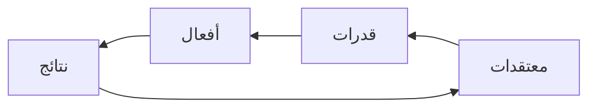

---  
title: إعادة تشغيل الذات - ياسر الحزيمي  
created: 2023-04-08 01:35:53  
updated: 2023-04-08 01:40:44  
aliases:  
  - إعادة تشغيل الذات - ياسر الحزيمي  
share: true  
website: ar/notes/videos  
tags:  
  - مصدر_معالج  
  - مصدر_فيديو  
  - مساق_إعادة  
  - فقه النفس  
---  
  
  
  
الحالة:: #مصدر/معالج    
النوع:: #مصدر/فيديو    
اﻷولوية:: 2    
الغرض:: الإنتاجية    
المنشيء:: منصة خطوة    
المدة:: 01:58:16    
الرابط:: <https://youtu.be/QP9-RZCJ07Q>    
المعرفة:: [فقه النفس](%D9%81%D9%82%D9%87%20%D8%A7%D9%84%D9%86%D9%81%D8%B3.md),    
التدريب:: #مساق/إعادة*تشغيل*الذات ,    
المؤثر:: ,    
تاريخ اﻹكمال:: [2023-04-08](2023-04-08.md)  
  
محاضرة إثرائية مخصصة لبرنامج (إشراق) والذي يشرف عليه الفاضل أ. بدر الثوعي   تحدث فيها الأستاذ ياسر عن المعتقدات وكيفية التعامل مع الإخفاق وأهمية أن يكون لك أثر في الحياة وثبات على المبدأ وأن تكون رقما صعبا   ــــــــــــــــــــــــ حساب تويتر  <a href="https://twitter.com/Alhozimey">https://twitter.com/Alhozimey</a> ــــــــــــــــــــــــ قناة التلجرام <a href="https://t.me/Alhozimey">https://t.me/Alhozimey</a>  
  
[إعادة تشغيل الذات - ياسر الحزيمي](https://youtu.be/QP9-RZCJ07Q)  
  
---  
  
## مقدمة  
  
- الذي لا يصبر على الإحراق، لا يحصل على الإشراق.  
  
## كيف نهتز من الداخل؟  
  

  
- الإنسان لديه مجموعة من:  
  1. **المعتقدات**.  
     - إذا أصبحت صافية تُرى اﻷمور بشكل صحيح.  
     - قناعة / شعور مبرر.  
     - المعتقد يهتز بالاختبار.  
     - الإنسان إذا ظن في نفسه مُعْتَقَدًا سلبيًا فإنه سيجد من الدلالات الكونية والبشرية ما يدل على أنه سلبي، وسيجد مبررات تضخم هذا المُعْتَقَد، ثمَّ لا يستطيع بعد ذلك حملها.  
  2. **القدرات**.  
     - إذا لم تستطع تغير معتقدك فارفع مستوى قدراتك.  
  3. **الأفعال**.  
  4. **النتائج**.  
     - النتائج تعينك بإذن الله تعالى على تغيير المعتقد.  
  
> يقول ابن القيم رحمة الله عليه: "وخير الناس الكامل في النفسه المكمل لغيره".  
  
- مشكلتنا أننا لا نريد أن نعرف، ونريد أن ننقل المعرفة. ولا نريد أن نحرر، ولكن نريد أن نمرر.  
  - لا تكن أنت الجسر الذي يوصل الناس إلى الجنة ثم تسقط أنت في النار.  
  - من الذي يزكي؟ الذي يبلغ **النصاب**.  
- الإنجازات المتراكمة ترفع الحافز على الاستمرار.  
- أعظم مرحلة يصلها الإنسان عندما لا يحتاج أن يريك نجاحه.  
  
> قال العرب: "الخوف قبل التجربة عجز".  
  
> قَالَتْ أُمُّ سُفْيَانَ [الثوري] لِسُفْيَانَ: «اذْهَبْ فَاطْلُبِ الْعِلْمَ حَتَّى أَعُولَكَ أَنَا بِمِغْزَلِي، فَإِذَا كَتَبْتَ عِدَّةَ أَحَادِيثَ فَانْظُرْ هَلْ تَجِدُ فِي نَفْسِكَ زِيَادَةً، فَاتَّبِعْهُ وَإِلَّا فَلَا تَبْتَغَينَّ»  
  
## كيف تغير نفسك؟  
  
1. اكتب المعتقدات غير الصحيحة، التي لا دليل عليها، ولم تجربها، ومبنية على ما يقول الآخرين.  
   - قسم معتقداتك إلى صحيحة وخاطئة، ومعيقة لك أو غير معيقة.  
2. مَتِّن قدراتك وأعرف ماذا تحتاج مما لا تقدر عليه.  
3. افعل! وابدأ بخطوة واحدة.  
4. ستحصل على نتائج تعزز المعتقد.  
  
- حياتنا المعاصرة صاخبة مشتتة قائمة على إثارة الحواس، وكل شيء فيها يخرجك عن ذاتك، فلا تجلس معها ولا تسمعها.  
- نحن في زمن غياب الوعي عن الذات! لأن وعينا دائمًا مصروف إلى الخارج.  
- "إذا بُذل المجهود، فأرضى بالموجود، وإن لم تحقق المقصود".  
  
### مصفوفة القدرة  
  
  
  
- فوق: الشعور بالقدرة.  
- تحت: عدم الشعور بالقدرة.  
- يمين: وجود القدرة.  
- يسار: عدم وجود القدرة.  
  
1. **الاغترار** = شعور بالقدرة + عدم وجودها.  
   - الاغترار تكشفه المواقف.  
2. **الثقة** = شعور بالقدرة + وجودها.  
3. **الوعي**: عدم وجود القدرة + ولا تشعر أنها موجودة، فهذا وعي بذاتك.  
4. **الاحتقار**: وجود القدرة + عدم الشعور بها.  
  
- كثير من الناس يقع في رقمي 1 و4، ولا يستطيع أن يميز ماهو واثق منه، وما هو واعٍ فيه.  
  
### منحنى ديننغ كروجر  
  
  
  
- الإنسان في بداية أي عمل أحيانًا يصيبه وهم الثقة فيشعر أنه قادر بنسبة 100%.  
- فإذا جرب (تجرِبة = خبرة + معرفة) تنخفض الثقة.  
- المشكلة في الانسحاب عند هذه النقطة.  
- ولو أكملت قليلًا سيصبح لديك ثقة حقيقية مستندة على المعرفة والخبرة.  
  
### تنبيه حول القدرات والأفعال  
  
- الكم يورث الكيف، والكثرة تُعَلِّم الإتقان، **والكمال في الاستكمال**.  
- من أراد أن "يتطور" فعليه أن "يتطوع".  
  
## كيف تصنع لنفسك تحديات؟  
  
  
  
- ثمت تحديات مرتفعة في حياتنا وأخرى منخفضة، ولدينا قدرات مرتفعة في شيء وأخرى منخفضة.  
  
1. **القلق**: وأنت تعيش دائمًا في تحديات أعلى من قدرتك.  
2. **اﻹثارة**: تحدٍ عال+ قدرة عليه.  
  
3. **اللامبالاة**: تحديات منخفضة، وقدرة منخفضة.  
4. **الملل**: تحدي منخفض وقدرة عالية.  
  
> "ألذُّ عَيْشٍ، هوًى وافق طاعة." عمر بن عبد العزيز.  
  
- كثير من التحديات التي أمامنا ليست المشكلة فيها مشكلة "قدرة"، وإنما مشكلة "دربة".  
  
## كيف تطور أدائك؟  
  
1. الملاحظة المقصودة.  
   - الاهتمام يورث الانتباه، وكلما زاد الاهتمام زاد مستوى الانتباه والتركيز.  
2. التقليد.  
3. التجريب.  
4. الممارسة.  
5. الإتقان.  
6. الإبداع.  
  
- دور المشرف والمربي:  
  
  - توفير نماذج إيجابية صالحة للملاحظة المقصودة.  
  - زراعة الاهتمامات.  
  - السماح بالتقليد.  
  - التشجِّيع على التجريب.  
  - المكافأة على الممارسة.  
  - الانتفاع بالإتقان.  
  - التعلم من الإبداع.  
  
- كل ميسر لما خلق له، فإذا أخفقت في أمر فأعلم أن هناك آخر تستطيع أن تتفوق فيه، وقد يكون الإشكال في الاختبار نفسه أو معياره.  
