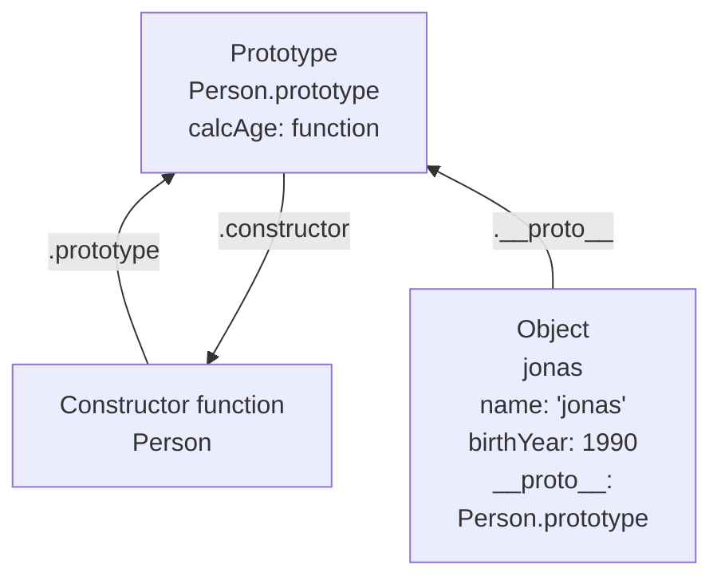
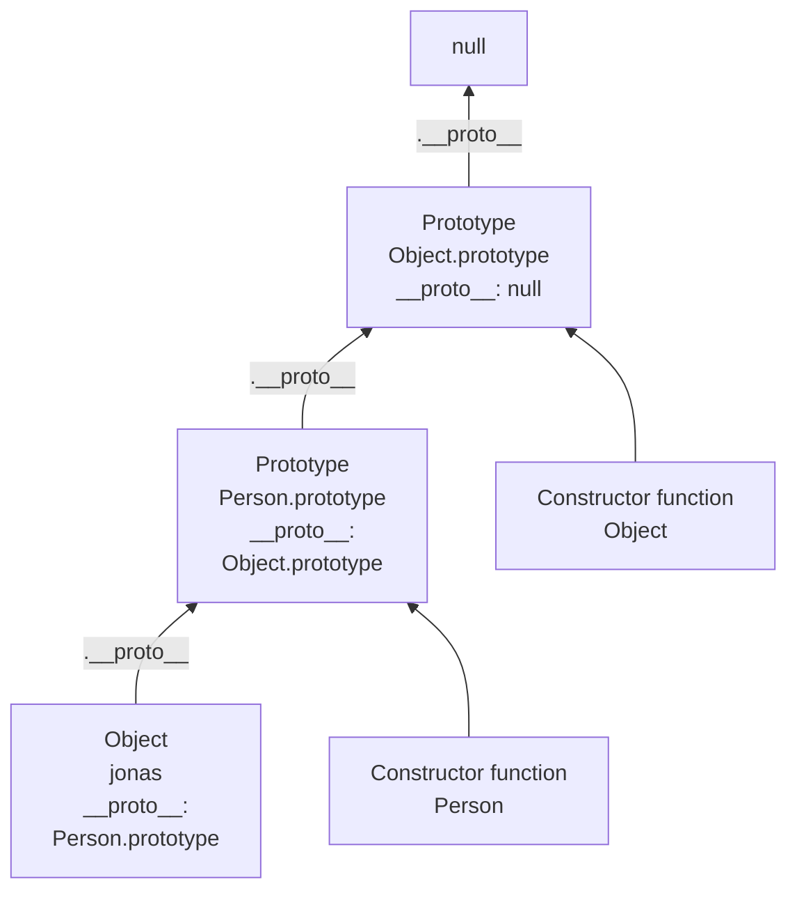
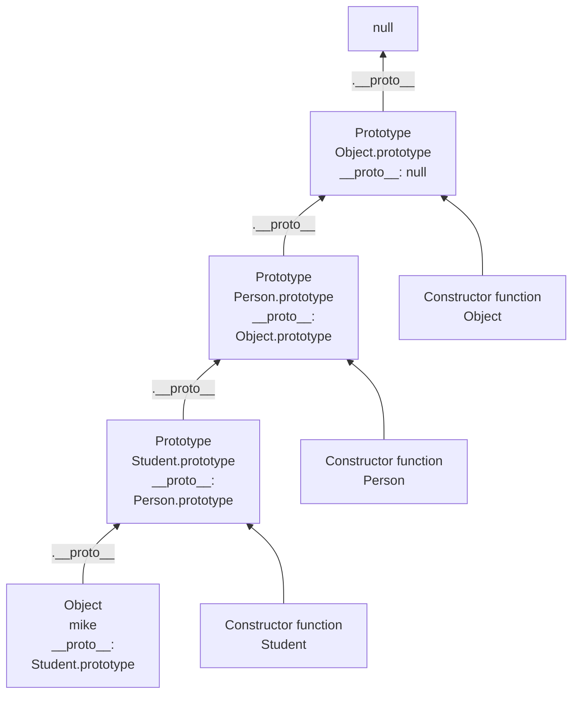
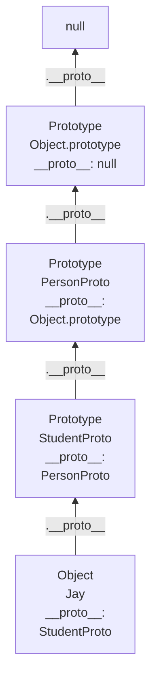

---  
title: JavaScript OOP  
created: 2022-07-07 15:23  
updated: 2022-08-02 08:09  
aliases:  
  - JavaScript OOP  
share: true  
website: en/notes/programming  
---  
  
المعرفة:: [JavaScript](JavaScript)  
الحالة:: #ملاحظة_مؤرشفة  
المراجع:: [The Complete JavaScript Course 2022 From Zero to Expert](The%20Complete%20JavaScript%20Course%202022%20From%20Zero%20to%20Expert), <https://developer.mozilla.org/en-US/docs/Web/JavaScript/Inheritance_and_the_prototype_chain>, <https://developer.mozilla.org/en-US/docs/Web/JavaScript/Reference/Classes>  
  
---  
  
```toc  
```  
  
## What is Object Oriented Programming (OOP)?  
  
- Object-oriented programming (OOP) is a programming paradigm based on the concept of objects.  
- We use objects to **model** (describe) real-world or abstract features.  
- Objects may contain data (properties) and code (methods). By using objects, we pack **data and the corresponding behavior** into one block.  
- In OOP, objects are **self-contained** pieces/blocks of code.  
- Objects are **building blocks** of applications, and **interact** with one another.  
- Interactions happen through a **public interface** (API): methods that the code outside of the object can access and use to communicate with the object.  
- OOP was developed with the goal of **organizing** code, to make it **more flexible and easier to maintain** (avoid spaghetti code).  
  
## 4 Fundamental OOP Principles  
  
### 1. Abstraction  
  
Ignoring or **hiding** details that **dont matter**, allowing us to get an **overview** perspective of the thing were implementing, instead of messing with details that dont really matter to our implementation.  
  
### 2. Encapsulation  
  
- Keeping properties and methods **private** inside the class, so they are **not accessible from outside the class**. Some methods can be Encapsulation as a public interface (API). ^577fc8  
- Prevents external code from accidentally manipulating internal properties/state.  
- Allows to change internal implementation without the risk of breaking external code.  
  
### 3. Inheritance  
  
Making all properties and methods of a certain class **available to a child class**, forming a **hierarchical relationship** between classes. This allows us to **reuse common logic** and to model real-world relationships.  
  
### 4. Polymorphism  
  
A child class can **overwrite** a method it inherited from a parent class [its more complex that that, but enough for our purposes].  
  
## Classical OOP vs Prototypes  
  
- JavaScript is a bit confusing for developers experienced in class-based languages (like Java or C++), as it is dynamic and does not have static types.  
  
- In JavaScript we have something called prototypes and all objects in JavaScript are linked to a certain prototype object.  
  
- The prototypical inheritance model is more powerful than the classic model even it's a little cofusing.  
  
|                                     **Classical OOP**                                    |                                                             **Prototypes**                                                             |  
| :--------------------------------------------------------------------------------------: | :------------------------------------------------------------------------------------------------------------------------------------: |  
| Objects (instances) are **instantiated** from a class, which functions like a blueprint. |                                                Objects are linked to a prototype object                                                |  
|               Behavior (methods) is **copied** from class to all instances.              | **Prototypal inheritance:** The prototype contains methods (behavior) that are **accessible to all objects linked to that prototype**. |  
|                                                                                          |                                        Behavior is **delegated** to the linked prototype object.                                       |  
  
## Prototypes Introduction  
  
- - JavaScript only has one construct: objects. Each object has a private property which holds a link to another object called its **prototype**. That prototype object has a prototype of its own, and so on until an object is reached with `null` as its prototype. By definition, `null` has no prototype, and acts as the final link in this **prototype chain**.  
  
- For example, `Array.prototype` is the prototype of all array objects we create in JavaScript. Therefore, all arrays have access to the `map` method. `map` method isn't defined in the array object itself but in its prototype.  
  
## 3 Ways Of Implementing Prototypal Inheritance  
  
### [1. Constructor Functions](#Constructor%20Functions%20and%20new%20Operator)  
  
- Technique to create objects from a function.  
- This is how built-in objects like Arrays, Maps or Sets are actually implemented.  
  
### [ 2. ES6 Classes](#ES6%20Classes)  
  
- Modern alternative to constructor function syntax.  
- Syntactic sugar: behind the scenes, ES6 classes work **exactly** like constructor functions.  
- ES6 classes do **NOT** behave like classes in classical OOP (last lecture).  
  
### [3. Object.create()](#Object.create())  
  
- The easiest and most straightforward way of linking an object to a prototype object.  
  
## Constructor Functions and `new` Operator  
  
- We can use constructor functions, to build an object using a function.  
- A constructor function is actually a completely normal function. The only difference between a regular function, and it, is that we call a constructor function with the `new` operator.  
  
```js  
const Person = function (firstName, birthYear) {  
  // Instance properties  
  this.firstName = firstName;  
  this.birthYear = birthYear;  
};  
// 1. New object is created  
// 2. function is called, this = the new object  
// 3. the new object linked to prototype  
// 4. function automatically return the new object  
const jonas = new Person('Jonas', 1991); // Person { firstName: 'Jonas', birthYear: 1991 }  
const matilda = new Person('Matilda', 2017); // Person { firstName: 'Matilda', birthYear: 2017 }  
const jack = new Person('Jack', 1975); // Person { firstName: 'Jack', birthYear: 1975 }  
```  
  
- In the code above we didn't technically create a class here because JavaScript doesn't really have classes in the sense of traditional OOP. However, we did create 3 objects from a constructor function.  
  
### How does Constructor Functions work?  
  
Here's what happen by using `new` operator:  
  
1. An empty object is created.  
2. `this` keyword in constructor function call is set to the new object.  
3. The new object is linked (**proto** property) to the constructor function’s prototype property.  
4. The new object is returned from the constructor function call. (Unless we're explicitly return something else)  
  
### `instanceof`  
  
- We can use `instanceof` to check if an object is an instance of a constructor function.  
  
```js  
console.log(jonas instanceof Person); // true  
```  
  
### Methods in Constructor Functions  
  
- We can add methods to constructor functions. But we should never create a method inside of a constructor function because each object created would have its copy of the same function which would be terrible for the performance.  
- Instead to solve this problem, we will use prototypes and prototype inheritance.  
  
```js  
const Person = function (firstName, birthYear) {  
  // Instance properties  
  this.firstName = firstName;  
  this.birthYear = birthYear;  
  // Never to this!  
  this.calcAge = function () {  
    console.log(2037 - this.birthYear);  
  };  
};  
```  
  
## Prototypes  
  
- Each and every function in JavaScript automatically has a property called prototype, and that includes constructor functions.  
- Every object that's created by a certain constructor function will get access to all the methods and properties that we define on the constructors prototype property.  
  
```js  
// Prototypes  
console.log(Person.prototype); // it will have calcAge function  
Person.prototype.calcAge = function () { // With this only one copy of the function will exist  
  console.log(2037 - this.birthYear);  
};  
// It works because any object always has access to the methods and properties from its prototype.  
jonas.calcAge(); // 46  
matilda.calcAge(); // 20  
```  
  
- Another example of coding challenge: [here](https://jsbin.com/mubuqumusa/edit?js,console).  
  
### `__proto__`  
  
- Each object has a special property called `__proto__` which equals the prototype object of its constructor function.  
  
```js  
console.log(jonas.__proto__ === Person.prototype); // true  
```  
  
### `isPrototypeOf()`  
  
- The constructor function's `prototype` object doesn't refer to its own `prototype` but to one of objects created by this constructor function.  
- The `isPrototypeOf()` method checks if an object exists in another object's prototype chain.  
  
```js  
console.log(Person.prototype.isPrototypeOf(jonas)); // true  
console.log(Person.prototype.isPrototypeOf(matilda)); // true  
console.log(Person.prototype.isPrototypeOf(Person)); // false  
```  
  
### Prototype Properties  
  
- We can also set properties on the prototype and not just methods.  
  
```js  
Person.prototype.species = 'Homo Sapiens';  
console.log(jonas.species, matilda.species); // Homo Sapiens  
```  
  
### `hasOwnProperty()`  
  
- Prototype properties are not available directly in the object but in it's prototype, so they aren't object's own properties.  
- Own properties are only the ones that are declared directly on the object itself.  
- We can check for own properties using `hasOwnProperty` method.  
  
```js  
console.log(jonas.hasOwnProperty('firstName')); // true  
console.log(jonas.hasOwnProperty('species')); // false  
```  
  
## How Prototypal Inheritance / Delegation Works  
  
- Everything starts with the `Person` the constructor function.  
- This constructor function has a `prototype` property which is an object.  
- Inside that object, we defined the `calcAge` method. `Person.prototype` itself has a reference back to `Person` which is the constructor property.  
- Remember, `Person.prototype` is not the prototype of `Person` but of all the objects that are created through the Person function .  
  
### How Prototypal Inheritance works with function constructors and ES6 classes  
  
- `Object.create()` doesn't work the same way.  
  
  
  
- When we attempt to call the `calcAge` function on the `jonas` object it can't be found directly in the object itself. If a property or a method cannot be found in a certain object, JavaScript will look into its prototype.  
- This behavior is what we call prototypal inheritance or delegation.  
  

  
## The Prototype Chain  
  
Series of links between objects, linked through prototypes (Similar to the [Scope Chain](,%20JavaScript%20Scoping#Scope%20Chain))  
  
**Explanation**:  
  
- `jonas` object is linked to  `person` function constructor `prototype` via the `__proto__` property.  
- `Person.prototype` itself is also an object and all objects in JavaScript have a prototype.  
- Prototype of `Person.prototype` is `Object.prototype`.  
  - `Person.prototype` is just a simple object which means that it has been built by the built-in `Object` constructor function and this is actually the function that gets called behind the scenes whenever we create an object literal using `{...}` syntax (`{...} === new Object(...)`) .  
  - `Person.prototype` itself needs to have a prototype and since it has been created by the `Object` constructor function its prototype is gonna be `Object.prototype`..  
- This entire series of links between the objects is what is called the prototype chain.  
- `Object.prototype`. is usually the top of the prototype chain which means that it's prototype is null.  
  

  
```js  
console.log(jonas.__proto__); // Person.prototype  
console.log(jonas.__proto__.__proto__); // Object.prototype (top of prototype chain)  
console.log(jonas.__proto__.__proto__.__proto__); // null  
```  
  
## Prototypal Inheritance on Built-In Objects  
  
- If we checked the prototype of the `Array` object, we can see that it has all these array's methods (filter, find, find, etc.) that we already know.  
- Each array doesn't contain all of these methods but instead, each array will inherit these methods from its prototype.  
- Any array prototype is exactly its constructor function.prototype `arr.__proto__ === Array.prototype // true`.  
- Once more, we can see that the Prototypal Inheritance is really a mechanism for reusing code. All of these built-in methods have to exist only once somewhere in the JavaScript engine and then all the arrays we create in the code get access to the functions through the Prototype Chain and Prototypal Inheritance.  
  
```js  
const arr = [3, 6, 6, 5, 6, 9, 9]; // new Array === []  
console.log(arr.__proto__); // Array.prototype  
console.log(arr.__proto__ === Array.prototype); // true  
console.log(arr.__proto__.__proto__); // Object.prototype  
```  
  
### Extending Built-In Objects Functionality  
  
- Knowing the last point, we can use that knowledge to extend the functionality of arrays even further. We can add any new method to Array's prototype and all the arrays will then inherit it.  
  
```js  
Array.prototype.unique = function () {  
  return [...new Set(this)];  
};  
console.log(arr.unique()); // [ 3, 6, 5, 9 ]  
```  
  
- **Warning**: Extending the prototype of a built-in object is generally not a good idea.  
  - The next version of JavaScript might add a method with the same name that we are adding. The code will then use that new method which works differently and that will probably break the code.  
  - When you work on a team of developers, if multiple developers implemented the same method with a different name then that's just going to create so many bugs that it's just not worth to do this.  
  
## ES6 Classes  
  
- Allows us to do the same thing as constructor function and setting method on prototype property but using a nicer and more modern syntax.  
- Classes are in fact **"special functions"**, and just as we can define [Function Expressions](,%20JavaScript%20Functions#Function%20Expressions) and [Function Declarations](,%20JavaScript%20Functions#Function%20Declarations), the class syntax has two components: **Class Expressions** and **Class Declarations**.  
- A function created by class is labelled by a special internal property `[](IsClassConstructor): true`. The language checks for that property in a variety of places. For example, unlike a regular function, it must be called with `new` keyword.  
- **Classes are first-class citizens**, they can be passed into functions and also returned from them.  
- The **body** of a class is always **executed** in **strict mode**.  
- **Instance properties** must be defined inside of class methods. [Computed Property Keys](,%20JavaScript%20ES6%20Enhanced%20Object%20Literals#Dynamic%20Computed%20Property%20Keys) is also supported.  
  
### Class Declarations  
  
- To declare a class, you use the `class` keyword with the name of the class.  
  
```js  
class PersonCl {  
  constructor(fullName, birthYear) {  
    this.fullName = fullName; // Instance properties  
    this.birthYear = birthYear;  
  }  
}  
  
class Rectangle {  
  constructor(height, width) {  
    this.height = height;  
    this.width = width;  
  }  
}  
```  
  
- An important difference between [function declarations](,%20JavaScript%20Functions#Function%20Declarations) and **class declarations** is that while functions can be called in code that appears before they are defined, **classes must be defined before they can be constructed**. This occurs because while the class is [hoisted](JavaScript%20Hoisting), its **values are not initialized**.  
  
```js  
const p = new Rectangle(); // ReferenceError  
  
class Rectangle {}  
```  
  
### Class Expressions  
  
- A class expression is another way to define a class.  
- Class expressions can be **named** or **unnamed**. The name can be accessed via the `name` property.  
- Class expressions **must be declared before they can be used** as well.  
  
```js  
// unnamed  
let Rectangle = class {  
  constructor(height, width) {  
    this.height = height;  
    this.width = width;  
  }  
};  
console.log(Rectangle.name); // Rectangle  
  
// named  
Rectangle = class Rectangle2 {  
  constructor(height, width) {  
    this.height = height;  
    this.width = width;  
  }  
};  
console.log(Rectangle.name); // Rectangle2  
```  
  
## Methods Definition  
  
### Constructor  
  
- The **constructor** method is a special method for creating and **initializing** an object created with a class.  
- There can **only** be **one** special method with the name **"constructor"** in a class.  
- A `SyntaxError` will be thrown **if** the class contains **more than one** occurrence of a constructor method.  
- A constructor can use the `super` keyword to call the constructor of the super class.  
  
### Prototype (Instance) Methods  
  
- Methods written outside the constructor will be added to `.prototype` property directly.  
- Starting with ECMAScript 2015, a shorter syntax for [method definitions on objects](,%20JavaScript%20ES6%20Enhanced%20Object%20Literals#Object%20Method%20Definition%20Shorthand) initializers is introduced.  
- It is a shorthand for a function assigned to the method's name.  
  
```js  
class PersonCl {  
  ...  
  // Instance methods  
  calcAge() {  
    console.log(2037 - this.birthYear);  
  }  
  greet() {  
    console.log(`Hey ${this.fullName}`);  
  }  
}  
  
const jessica = new PersonCl('Jessica Davis', 1996);  
jessica.calcAge(); // 41  
```  
  
- Prototype methods behave exactly as adding the function to prototype object manually.  
  
```js  
PersonCl.prototype.greet = function () {  
  console.log(`Hey ${this.firstName}`);  
};  
jessica.greet();  
```  
  
## Getters and Setters  
  
- Every object in JavaScript can have **setter** and **getter** properties.  
- These special properties are called **assessor properties**, while the more normal properties are called **data properties**.  
- **Getters** and **setters** are basically **functions that get and set a value**, but on the outside they still **look like regular properties**. This can be very useful when we want to **read something as a property**, but still need to **do some calculations before**.  
- It is **not mandatory to specify a setter when we have a getter** for the same property, just a getter or just a setter would be enough.  
  
```js  
const account = {  
  owner: 'Jonas',  
  movements: [200, 530, 120, 300],  
  get latest() {  
    return this.movements.slice(-1).pop();  
  },  
  set latest(mov) {  
    this.movements.push(mov);  
  },  
};  
console.log(account.latest); // 300  
account.latest = 50;  
console.log(account.movements); // [ 200, 530, 120, 300, 50 ]  
```  
  
- **Getters** and **setters** work for any **regular object** in JavaScript, **classes** also have them, and they work in the exact same way.  
  
```js  
class PersonCl {  
  ...  
  get age() {  
    return 2037 - this.birthYear;  
  }  
}  
  
const jessica = new PersonCl('Jessica Davis', 1996);  
console.log(jessica.age); // 41  
```  
  
- **Setters** and **getters** can be very useful for data validation.  
  
```js  
class PersonCl {  
  constructor(fullName, birthYear) {  
    this.fullName = fullName;  
    this.birthYear = birthYear;  
  }  
  // Set a property that already exists  
  set fullName(name) {  
    if (name.includes(' ')) this._fullName = name;  
    else alert(`${name} is not a full name!`);  
  }  
  get fullName() {  
    return this._fullName;  
  }  
}  
```  
  
## Static Methods  
  
- Static properties and methods are **called without instantiating** their class and **cannot be called through a class instance**.  
- Static methods are **often used to create utility functions** for an application, whereas static properties are useful for caches, fixed-configuration, or any other data you **don't need to be replicated** across instances.  
- For example, `Array.from` method which converts any array like structure to a real Array, is **attached to the Array constructor and not the prototype property of the constructor**, so we could not use it on an Array because Arrays don't inherit this method.  
  
```js  
Array.from(document.querySelectorAll('h1')); // [h1]  
[1, 2, 3].from() // TypeError  
```  
  
- Creating a static method with [](#Constructor%20functions):  
  
```js  
Person.hey = function () {  
  console.log('Hey there!');  
  console.log(this); // constructor function itself  
};  
  
Person.hey();  
```  
  
- Static methods in classes:  
  
```js  
class PersonCl {  
  ...  
  // Static method  
  static hey() {  
    console.log('Hey there 👋');  
    console.log(this); // the entire class  
  }  
};  
PersonCl.hey();  
```  
  
## Object.create()  
  
- The **`Object.create()`** method **creates a new object, using an existing object as the prototype** of the newly created object.  
- With `Object.create()`, there is still the idea of [prototypal inheritance](#How%20Prototypal%20Inheritance%20Delegation%20Works). However, there are **no prototype properties involved**, **no constructor functions**, and **no new operator**.  
- We can use `Object.create()` to essentially manually set the prototype of an object, to any other object that we want.  
- In the real world, this is the least used way of implementing prototypal inheritance.  
  
```js  
const PersonProto = {  
  calcAge() {  
    console.log(2037 - this.birthYear);  
  }  
};  
const steven = Object.create(PersonProto);  
console.log(steven); // {}  
steven.name = 'Steven';  
steven.birthYear = 2002;  
steven.calcAge(); // 35  
console.log(steven.__proto__ === PersonProto); // true  
```  
  
- We can create a constructor-like method to set properties on creating a new object, for example, the following `init` method:  
  
```js  
const PersonProto = {  
  calcAge() {  
    console.log(2037 - this.birthYear);  
  },  
  init(firstName, birthYear) {  
    this.firstName = firstName;  
    this.birthYear = birthYear;  
  },  
};  
const sarah = Object.create(PersonProto);  
sarah.init('Sarah', 1979);  
sarah.calcAge(); // 58  
```  
  
## Inheritance  
  
### Inheritance Between Classes: Constructor Functions  
  
- When we build a "child" constructor function, instead of having duplicate lines for setting properties, we can **use `Object.call` method of parent constructor** function with [this keyword](,%20JavaScript%20This%20Keyword#%5EcallApplyBind) and other parameters.  
- To **link prototypes** of parent and child we use `Object.create()` and do `Child.prototype = Object.create(Parent.prototype);`. This must happen **before adding any new method to the prototype**, otherwise prototype will be overridden.  
- When **two methods or properties have the same name in a prototype chain**, the **first one** that appears in the chain is the one that **will be used**.  
  
```js  
// Parent  
const Person = function (firstName, birthYear) {  
  this.firstName = firstName;  
  this.birthYear = birthYear;  
};  
Person.prototype.calcAge = function () {  
  console.log(2037 - this.birthYear);  
};  
  
// Child  
// 1. Constructor Function  
const Student = function (firstName, birthYear, course) {  
  // this.firstName = firstName;  
  // this.birthYear = birthYear;  
  Person.call(this, firstName, birthYear); // set parent properties  
  this.course = course;  
};  
  
// 2. Linking prototypes  
Student.prototype = Object.create(Person.prototype);  
  
// Wrong way of doing it:  
// Student.prototype = Person.prototype; // This won't work as it sets Student.prototype to be the same object of Person.prototype  
  
// 3. Adding a new method the normal way  
Student.prototype.introduce = function () {  
  console.log(`My name is ${this.firstName} and I study ${this.course}`);  
};  
  
// Using child  
const mike = new Student('Mike', 2020, 'Computer Science');  
mike.introduce(); // My name is Mike and I study Computer Science  
mike.calcAge() // 17  
```  
  
- We can check if prototype chain is set up correctly.  
  
```js  
console.log(mike.__proto__); // Student  
console.log(mike.__proto__.__proto__); // Person  
console.log(mike instanceof Student);  
console.log(mike instanceof Person);  
console.log(mike instanceof Object);  
```  
  
- If we inspected the `Student` object in console we can see that prototype is set to `Person`. We can fix that by setting `.prototype.constructor` to `Student` object.  
  
```js  
/**  
Student {firstName: 'Mike', birthYear: 2020, course: 'Computer Science'}  
	birthYear: 2020  
	course: "Computer Science"  
	firstName: "Mike"  
	[](Prototype): Person  
**/  
Student.prototype.constructor = Student;  
console.dir(Student.prototype.constructor);  
/**  
ƒ Student(firstName, birthYear, course)  
	arguments: null  
	caller: null  
	length: 3  
	name: "Student"  
	prototype: Person {introduce: ƒ, constructor: ƒ}  
	[](FunctionLocation): VM321:9  
	[](Prototype): ƒ ()  
	[](Scopes): Scopes[2]  
**/  
```  
  
- Here's what **prototype chain** looks like:  
  

  
### Inheritance Between Classes: ES6 Classes  
  
- The `extends` keyword is used in **class declarations** or **class expressions** to create a class as **a child** of another class.  
- If there is a constructor present in the subclass, it needs to first call `super()` before using "`this`" to call the super class constructor and pass in parameters.  
- If there's no constructor, the super function will be automatically called with all arguments that are passed into child class.  
  
```js  
// Parent class  
class PersonCl {  
  constructor(fullName, birthYear) {  
    this.fullName = fullName;  
    this.birthYear = birthYear;  
  }  
  // Instance methods  
  calcAge() {  
    console.log(2037 - this.birthYear);  
  }  
  greet() {  
    console.log(`Hey ${this.fullName}`);  
  }  
  get age() {  
    return 2037 - this.birthYear;  
  }  
  set fullName(name) {  
    if (name.includes(' ')) this._fullName = name;  
    else alert(`${name} is not a full name!`);  
  }  
  get fullName() {  
    return this._fullName;  
  }  
  // Static method  
  static hey() {  
    console.log('Hey there 👋');  
  }  
}  
  
// Child class  
class StudentCl extends PersonCl {  
  constructor(fullName, birthYear, course) {  
    // Always needs to happen first!  
    super(fullName, birthYear); // call the super class constructor and pass in fullName and birthYear parameters  
    this.course = course;  
  }  
  // New method  
  introduce() {  
    console.log(`My name is ${this.fullName} and I study ${this.course}`);  
  }  
  // Override parent method  
  calcAge() {  
    console.log(  
      `I'm ${  
        2037 - this.birthYear  
      } years old, but as a student I feel more like ${  
        2037 - this.birthYear + 10  
      }`  
    );  
  }  
}  
const martha = new StudentCl('Martha Jones', 2012, 'Computer Science');  
martha.introduce(); // My name is Martha Jones and I study Computer Science  
martha.calcAge(); // I'm 25 years old, but as a student I feel more like 35  
```  
  
### Inheritance Between Classes: Object.create()  
  
- First, we **create an object** that will be the prototype of the child objects. `StudentProto`  
- Second, we can **add an init method** to the prototype of the child objects so we don't have to manually specify the properties on any new child object.  
- Inside init, we can **use `Object.call` method of parent constructor** function with [this keyword](,%20JavaScript%20This%20Keyword#%5EcallApplyBind) and other parameters to pass the parameters without having duplicate code, similar as we did in [](#Inheritance%20Between%20Classes%20Constructor%20Functions).  
  
```js  
// Parent  
const PersonProto = {  
  calcAge() {  
    console.log(2037 - this.birthYear);  
  },  
  init(firstName, birthYear) {  
    this.firstName = firstName;  
    this.birthYear = birthYear;  
  },  
};  
const steven = Object.create(PersonProto);  
// Child  
const StudentProto = Object.create(PersonProto); // 1. Create  
StudentProto.init = function (firstName, birthYear, course) { // 2. Init  
  PersonProto.init.call(this, firstName, birthYear); // set parent init parameters  
  this.course = course; // set rest child parameters  
};  
// A new method  
StudentProto.introduce = function () {  
  console.log(`My name is ${this.firstName} and I study ${this.course}`);  
};  
// Create and use a new child object  
const jay = Object.create(StudentProto);  
jay.init('Jay', 2010, 'Computer Science');  
jay.introduce(); // My name is Jay and I study Computer Science  
jay.calcAge(); // 27  
```  
  
- Here's what **prototype chain** looks like, where Student inherits from Person:  
  

  
## Protected Properties and Methods  
  
- Remember that Encapsulation is:  
  
  
  
- JavaScript classes actually do not yet support real data privacy and encapsulation. We can **fake encapsulation** by simply using the **convention of adding an underscore in front of the property name**. This doesn't make the property truly private and it's **still can be accessed**, but at least now everyone on your team and that includes yourself will know that this property is not supposed to be touched outside of the class.  
  
```js  
class Account {  
  constructor(owner, currency, pin) {  
    this.owner = owner;  
    this.currency = currency;  
    // Protected property  
    this._pin = pin;  
    this._movements = [];  
    this.locale = navigator. language;  
    console.log(`Thanks for opening an account, ${owner}`);  
  }  
  // Public interface  
  getMovements() {  
    return this._movements;  
  }  
  deposit(val) {  
    this._movements.push(val);  
  }  
  withdraw(val) {  
    this.deposit(-val);  
  }  
  _approveLoad(val) {  
    return true;  
  }  
  requestLoan(val) {  
    if (this._approveloan(val)) {  
    this.deposit(val);  
    console.log('Loan approved');  
  }  
}  
```  
  
## Class Fields and Methods  
  
- Class Fields Declaration is a ECMAScript proposal which is currently at Stage 3 in the TC-39 process. This proposal will **allow to add instance properties directly as a property on the class** without having to use the constructor method.  
- Why is this proposal actually called Class fields? In traditional OOP languages like Java and C++, properties are usually called fields.  
- The important difference of **class fields** is that they are **set on individual objects**, not `.prototype`. That's why we can also call this it **instance field**.  
- Class Fields can be **static** also, whether they are public or private.  
  
### Public field declarations  
  
- We don't need keywords like `let`, `const`, or `var` to declare fields. By declaring fields up-front, class definitions become more self-documenting, and the fields are always present. The fields can be declared with or without a default value.  
  
```js  
class Rectangle {  
  height = 0;  
  width;  
  constructor(height, width) {  
    this.height = height;  
    this.width = width;  
  }  
}  
```  
  
### Public static fields  
  
- Public static fields are useful when you want a field to exist **only once per class**, not on every class instance you create. This is **useful for caches, fixed-configuration**, or any other **data you don't need to be replicated across instances**.  
- Fields **without initializers** are initialized to **undefined**.  
- Public static fields are **not reinitialized on subclasses**, but **can be accessed** via the prototype chain.  
  
```js  
class ClassWithStaticField {  
  static staticField = 'static field'  
}  
console.log(ClassWithStaticField.staticField) // "static field"  
```  
  
### Private Class Fields and Methods  
  
- **Class fields are public by default**, but **private class members can be created by using a hash `#` prefix**. The privacy encapsulation of these class features is enforced by JavaScript itself.  
- **Trying to access** the private field **outside** of the class will generate a `SyntaxError`. Trying to **access** Private field **from a subclass** will result in `SyntaxError` as well.  
- **Private instance methods** are methods available on class instances whose **access is restricted** in the same manner as private instance fields.  
- **Private static fields** are only **accessible on the class itself** or on the this context of static methods, but not on the this context of instance methods.  
- **Private static methods** are called on the class itself, not instances of the class, like their public equivalent, and like private static fields, they are **only accessible from inside** the class declaration.  
  
```js  
class ClassWithPrivateMethod {  
  #privateMethod() {  
    return 'hello world';  
  }  
  
  getPrivateMessage() {  
    return this.#privateMethod();  
  }  
}  
  
const instance = new ClassWithPrivateMethod();  
console.log(instance.getPrivateMessage()); // hello world  
```  
  
### Example  
  
```js  
// Encapsulation: Protected Properties and Methods  
// Encapsulation: Private Class Fields and Methods  
// 1) Public fields  
// 2) Private fields  
// 3) Public methods  
// 4) Private methods  
// (there is also the static version)  
class Account {  
  // 1) Public fields (instances)  
  locale = navigator.language;  
  // 2) Private fields (instances)  
  #movements = [];  
  #pin;  
  constructor(owner, currency, pin) {  
    this.owner = owner;  
    this.currency = currency;  
    this.#pin = pin;  
    // Protected property  
    // this._movements = [];  
    // this.locale = navigator.language;  
    console.log(`Thanks for opening an account, ${owner}`);  
  }  
  // 3) Public methods  
  // Public interface  
  getMovements() {  
    return this.#movements;  
  }  
  deposit(val) {  
    this.#movements.push(val);  
    return this;  
  }  
  withdraw(val) {  
    this.deposit(-val);  
    return this;  
  }  
  requestLoan(val) {  
    if (this.#approveLoan(val)) {  
      this.deposit(val);  
      console.log(`Loan approved`);  
      return this;  
    }  
  }  
  static helper() {  
    console.log('Helper');  
  }  
  // 4) Private methods  
  #approveLoan(val) {  
    return true;  
  }  
}  
const acc1 = new Account('Jonas', 'EUR', 1111); // "Thanks for opening an account, Jonas"  
// acc1._movements.push(250);  
// acc1._movements.push(-140);  
// acc1.approveLoan(1000);  
acc1.deposit(250);  
acc1.withdraw(140);  
acc1.requestLoan(1000); // "Loan approved"  
console.log(acc1.getMovements()); // [250, -140, 1000]  
console.log(acc1); // { currency: "EUR", locale: "en-US", owner: "Jonas" }  
Account.helper(); // "Helper"  
// console.log(acc1.#movements);  
// console.log(acc1.#pin);  
// console.log(acc1.#approveLoan(100));  
```  
  
## Methods Chaining  
  
- We can implement the ability of **chaining methods** in the methods of our class, similar to array methods. All we have to do is to **return the object itself `this` at the end of a method that we want to be chainable**.  
  
```js  
acc1.deposit(300).deposit(500).withdraw(35).requestLoan(25000).withdraw(4000);  
console.log(acc1.getMovements());  
```  
  
## ES6 Classes Summary  
  
- Classes are just “**syntactic sugar**” over constructor functions.  
- Classes are **not hoisted**.  
- Classes are **first-class** citizens.  
- Class body is **always executed in strict mode**.  
  
```js  
class Student extends Person {  
  /*   
  Person: Parent class.  
  extends: Inheritance between classes, automatically sets prototype.  
  Student: Child class.  
  */  
  university = "University of Lishon"; // Public field (similar to property, available on created object)  
  static numSubjects = 10; // Static public field (available only on class)  
  #studyHours = 0; // Private fields (not accessible outside of class)  
  #course; // undefined private field  
  constructor(fullName, birthYear, startYear, course) {  
    /*  
    Constructor method, called by new operator. Mandatory in regular class, might be omitted in a child class.  
    */  
    super(fullName, birthYear); // Call to parent (super) class (necessary with extend). Needs to happen before accessing this  
    this.startYear = startYear; // Instance property (available on created object)  
    this.#course = course; // Redefining private field  
  }  
  introduce() { // Public method  
    console.log(`I study $S${this.#course} at ${this.university}`);  
  }  
  study(h) {  
    this.#makeCoffe(); // Referencing private field and method  
    this.#studyHours += h;  
  }  
  #makeCoffe() { // Private method (⚠ Might not yet work in your browser. “Fake” alternative: _ instead of #)  
    return "Here is a coffe for you";  
  }  
  get testScore() { // Getter method  
    return this._testScore;  
  }  
  set testScore(score) { // Setter method (use _ to set property with same name as method, and also add getter)  
    this._testScore = score < 20 ? score : 0;  
  }  
  static printCurriculum() { // Static method (available only on class. Can not access instance properties nor methods, only static ones)  
    console.log(`There are ${this.numSubjects} subjects`);  
  }  
}  
// Creating new object with new operator  
const student = new Student("Jonas", 2020, 2037, "Medicine");  
```  
