---  
created: 2022-05-22 14:34  
updated: 2022-06-20 18:25  
title: Programming Foundations - Object-Oriented Design  
share: true  
website: en/notes/programming  
---  
# Programming Foundations - Object-Oriented Design Study Notes  
  
## APIE  
  
- Abstraction  
- Polymorphism  
- Inheritance  
- Encapsulation  
  
Object Oriented:  
  
- Analysis  
- Design  
- Programming  
  
---  
  
## 5 Steps Approach  
  
1. Gather requirements.  
  
2. Describe the application.  
3. Identify the main objects.  
4. Describe the interactions.  
5. Create a class diagram.  
  
---  
  
## Unified Modeling Language (UML)  
  
Standardized notation for diagrams to visualize object-oriented systems.  
  
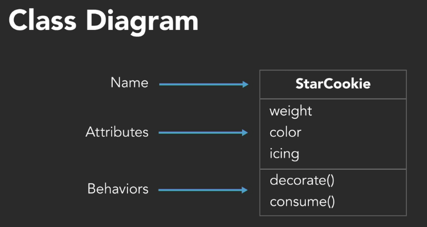  
  
### Types of UML Diagrams  
  
- Structural diagrams  
  - **Class diagram**  
  - Package diagram  
  - Component diagram  
  - Profile diagram  
  - Deployment diagram  
  - Object diagram  
- Behavioral diagrams  
  - **Use case diagram**  
  - Communication diagram  
  - Activity diagram  
  - Interaction overview diagram  
  - State machine diagram  
  - Timing diagram  
  - Sequence diagram  
  
---  
  
## Requirements  
  
Requirements = What does it need to do?  
  
- Functional requirements: What **must** it do?  
  - Has nothing to do with object orientation, or classes.  
- Non-functional requirements: How **should** it do it?  
  - The absolute minimum set of requirements  
  - Can include:  
    - Legal  
    - Performance  
    - Support  
    - Security  
  
### FURPS Requirements  
  
- **Functionality**: Capability, Re-usability, Security  
- **Usability**: Human Factors, Aesthetics, Consistency, Documentation  
- **Reliability**: Availability, Failure Rate &  
  Duration, Predictability  
- **Performance**: Speed, Efficiency, Resource  
  Consumption, Scalability  
- **Supportability**: Testability, Extensibility,  
  Serviceability, Configurability  
  
#### FURPS+  
  
Adds the following categories:  
  
- Design  
- Implementation  
- Interface  
- Physical  
  
#### References  
  
- Software Requirements by Karl Wiegers  
- Mastering the Requirements Process by Suzanne and James Robertson  
  
### Jukebox Example  
  
- **Functional Requirement**: The system must...  
  - Maintain a queue of songs to play  
    
  - Play music!  
    
  - ~~Have a button that the user can click to sort by artist~~ Allow users to sort by artist  
    
  - Identify individual users  
    
  - Track number of plays per user  
    
- **Non-functional requirements**: The system should be...   
  - Intuitive to use while floating in space  
  - Available 24/7  
  - Low-power  
  - Updatable  
  
---  
  
## Use Cases and User Stories  
  
### Use Cases  
  
- **Title**: What is the goal? (Short phrase of an active verb that describes the goal)  
- **Primary Actor**: Who desires it? (Any external entity that acts on the system incl. users and other computers)  
- **Success Scenario**: How is it accomplished?  
  
#### Example  
  
##### Scenario as paragraph  
  
- **Title**: Heat Meal  
- **Primary Actor**: Astronaut  
- **Success Scenario**: Astronaut inserts meal package. System identifies type of meal. System heats package for length of time required for meal type. System notifies astronaut that meal is ready via space pager. Astronaut removes package from system.  
  
##### Scenario as steps  
  
- **Title**: Heat Meal  
- **Primary Actor**: Astronaut  
- **Success Scenario**:  
  1. Astronaut inserts meal package.  
  2. System identifies type of meal.  
  3. System heats package for length of time required for meal type.  
  4. System notifies astronaut that meal is ready via space pager.  
  5. Astronaut removes package from system.  
  
##### Additional Details  
  
- **Extensions**:  
  
  - 2a Describe steps for unidentifiable package.  
  
  - 4a Describe steps for space-pager system error.  
  
- **Preconditions**: Customer has selected meal to prepare.  
  
- **Postconditions**: ...  
  
- **Secondary Actors**: ...  
  
- **Stakeholders**: ...  
  
- **Scope**: ...  
  
- **Priority**: ...  
  
- **Owner**: ...  
  
#### References  
  
- Writing Effective Use Cases by Alistair Cockburn  
  
#### Identifying Actors  
  
- Using / Monitoring  
- Primary Actor: not the most important but the one who initiated the event.  
  
#### Identifying Scenarios  
  
- **Active Voice**: Omit Needless Words  
  - Example 1:  
    - Not this: ~~The system is provided with the meal package by the astronaut.~~  
    - This: Astronaut inserts meal package.  
  - Example 2: Don't write pseudo code  
    - Not this: ~~The system connects to the external pager system over HTTPS and uses JSON to submit the formatted text message that is to be transmitted, and then waits for a delegated callback response.~~  
    - This: System sends pager message.  
  - Example 3: User Interface:  
    - Describe the scenario without using words like "screen, click, button, select", and focus on the **intention**.  
  
#### Use Case Prompts  
  
- Who performs system administration tasks?  
- Who manages users and security?  
- What happens if the system fails?  
- Is anyone looking at performance metrics or logs?  
  
### User stories  
  
- Shorter and simpler than use cases.  
- Usually follows the format:  
  - As a (*type of user*) I want (*goal*) so that (*reason*)   
- Focus on intent, not the user interface.  
  
|        **User Stories**        |       **Use Cases**        |  
| :----------------------------: | :------------------------: |  
|     Short (one index card)     |     Long (a document)      |  
|      One goal, no details      | Multiple goals and details |  
|            Informal            |  Casual to (very) formal   |  
| “Placeholder for conversation” |  “Record of conversation”  |  
  
### Jukebox Example  
  
#### Use Cases  
  
- **Title**: Play a Song  
- **Primary Actor**: User  
- **Success Scenario**: System identifies user. User browses library of available albums. User selects an album and browses list of songs on the selected album. User selects a song. System plays the selected song.  
  
- **Title**: Select Multiple Songs  
- **Primary Actor**: User  
- **Success Scenario**:  
  1. System identifies user.  
  2. User browses available albums and songs.  
  3. User selects a song.  
  4. System begins playing selected song.  
  5. User continues browsing and selects a second song.  
  6. System adds second song to play queue.  
  7. System plays second song after first song is over.  
  
##### User Stories   
  
- As a *user*, I want *my song to be added to the front of a long play queue*, so that *I don’t have to wait hours to hear it*.  
- As a *user*, I want *to be identified without touching anything*, so that *my hands are free to do other things*.  
- As a *user*, I want *to sort and browse songs by artist*, so that *I can listen to every song by xyz*.  
  
---  
  
## Domain Modeling  
  
- **Conceptual Model**: Represents important objects (things) and the relationships between them.  
  
### Identifying Objects  
  
Example:   
  
- **“Dodge” Use Case Scenario**: <u>System</u> spawns enemy <u>spaceship</u> in play area. Spaceship flies towards player <u>asteroid</u> and fires <u>missile</u> at <u>it</u>. <u>Player</u> steers asteroid in <u>direction</u> to avoid missile <u>path</u>. Missile flies past player asteroid and disappear <u>offscreen</u>.  
- Final list: **Spaceship Player Area Path Direction Asteroid Missile**  
  
### Identifying Class Relationships  
  
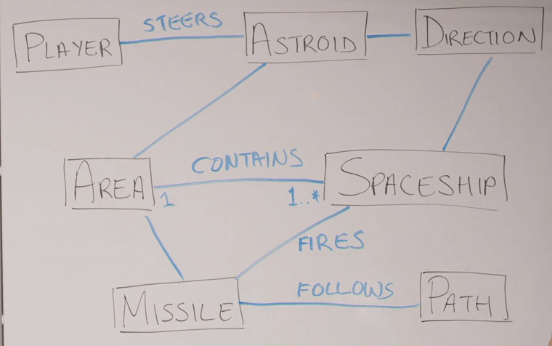  
  
### Identifying Class Responsibilities  
  
- Look for verbs.  
  - **“Dodge” Use Case Scenario**: System <u>spawns enemy spaceship</u> in play area. Spaceship <u>flies towards player</u> asteroid and <u>fires missile</u> at it. Player <u>steers asteroid</u> in direction to avoid missile path. Missile <u>flies past player</u> asteroid and <u>disappear offscreen</u>.  
  
- An object should be responsible for itself.  
- Don't give too much behavior to a certain actor (common mistake).  
  
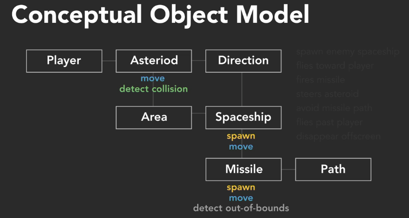  
  
- Avoid global master objects.  
  
### CRC cards  
  
- Class Responsibility Collaboration.  
- Same information as Conceptual Object Diagram in a differrent format.  
- Also known as CRH cards: Component Responsibilities Helper.  
  
### Jukebox Example  
  
Picking out nouns:  
  
- **Use Case Scenario**: **System** identifies **user**. User browses **library** of available **albums**. User selects an album and browses **list** of **songs** on the selected album. User selects a song. System plays the selected song. User continues browsing and selects a second song. System adds second song to play **queue**. System plays second song after first song is over.  
- **User Story**: As **a commander**, I want the **ability** to cancel other **user selections**, so that I don’t have to listen to **disco** the whole way to the **moon**!  
- **Objects**: User Library Album Song Queue Admin  
  
Picking out verb phrases:  
  
- **Use Case Scenario**: System **identifies user**. User **browses library** of available albums. User **selects an album** and **browses list of songs** on the selected album. User **selects a song**. System **plays the selected song**. User **continues browsing** and **selects a second song**. System **adds second song to play queue**. System **plays second song** after first song is over.  
- **User Story**: As a commander, | want the ability to **cancel other user selections**, so that | don’t have to listen to disco the whole way to the moon!  
- **Verb Phrases**: Browse library of albums -  Browse songs in album -  Select album - Select song - Play selected song - Add song to queue - Play song from queue - Cancel song in queue - Identify user.  
  
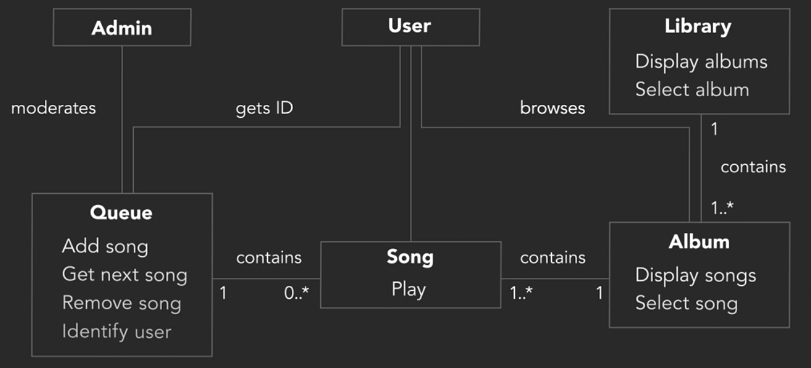  
  
---  
  
## Class Diagrams  
  
- ClassName  
- Attributes  
  - Data type can be added after colon  
  - Default value can be added after equals sign  
  - Static Members are underlined in the UML  
- Methods  
  - Parameters can be put between the parentheses.  
  - Signs + and - refers to visibility.  
  
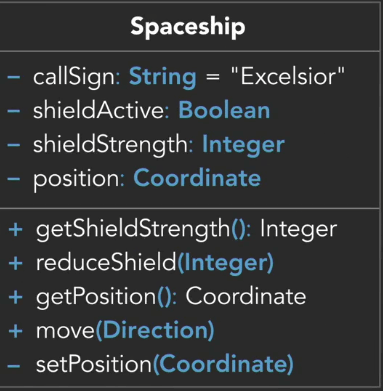  
  
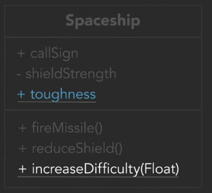  
  
### Jukebox Example  
  
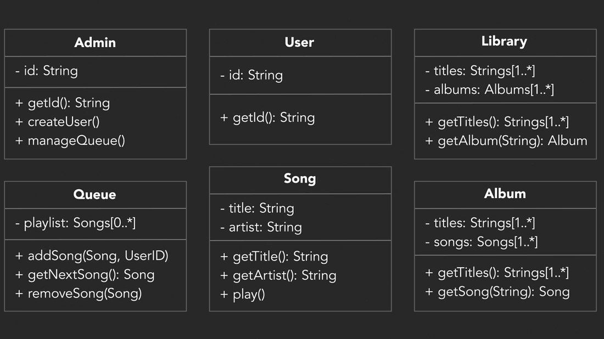  
  
---  
  
## Inheritance and Composition  
  
### Inheritance  
  
- **Inheritance Describes an “Is a” / “Is a kind of”  Relationship:** A StarFighter is a Spaceship.  
  
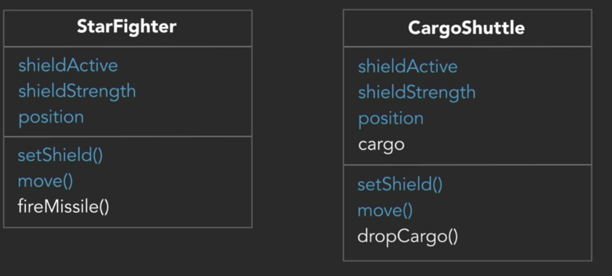  
  
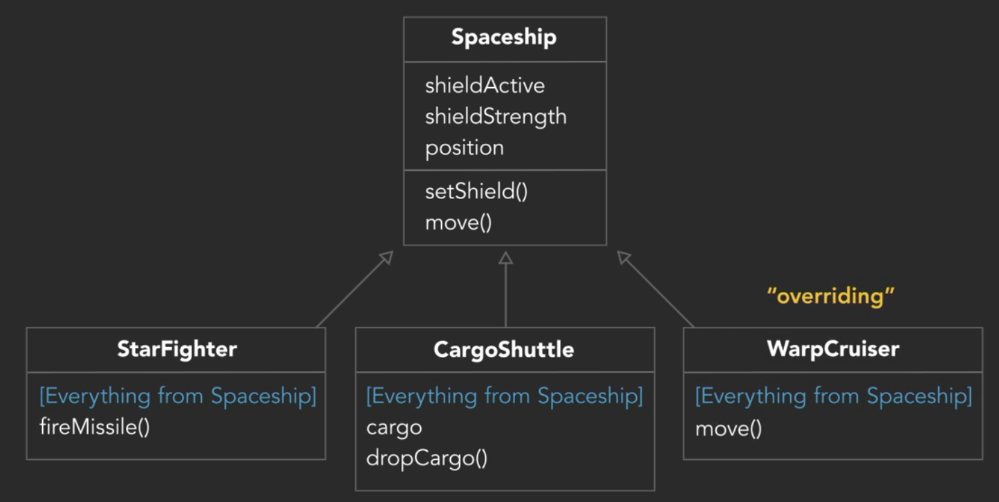  
  
### Abstract Class:  
  
- Exists for other classes to inherit  
- Cannot be instantiated  
- Contains at least one abstract method  
- Abstract classes represent a type.  
  
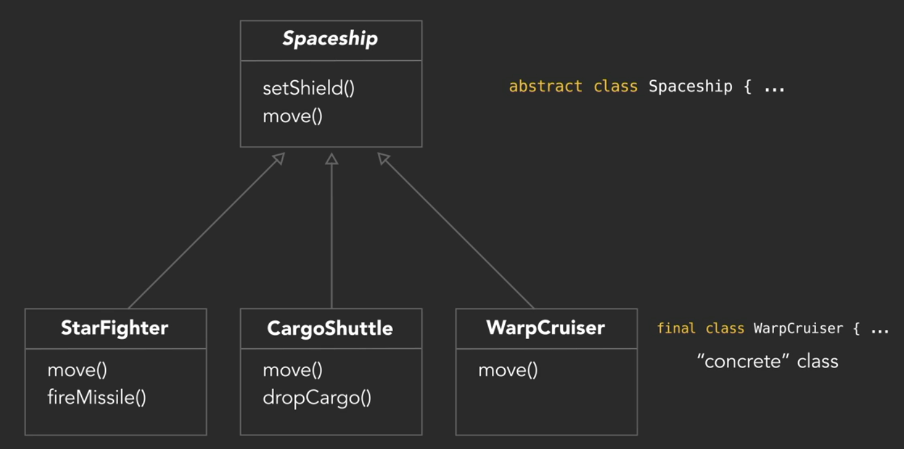  
  
### Interfaces  
  
- **Interface**: List of methods for a class to implement. It doesn’t contain any actual behavior.  
- **Interfaces** represent a capability.  
  
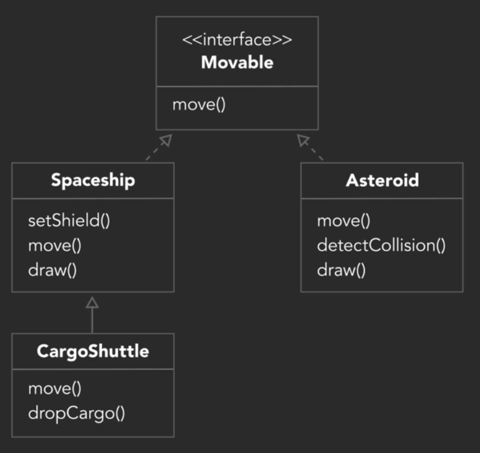  
  
### Aggregation  
  
- "Has a/many" relationship.  
- "Uses a/many"  
  
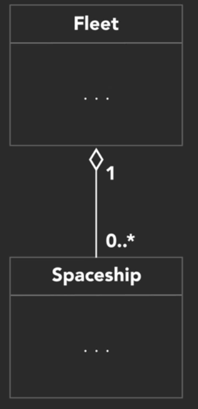  
  
### Composition  
  
- A more specfic form of aggregation.  
- Implies ownership.  
  
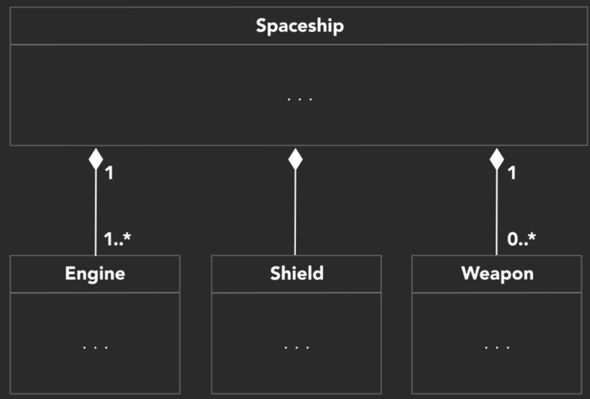  
  
### UML Arrows  
  
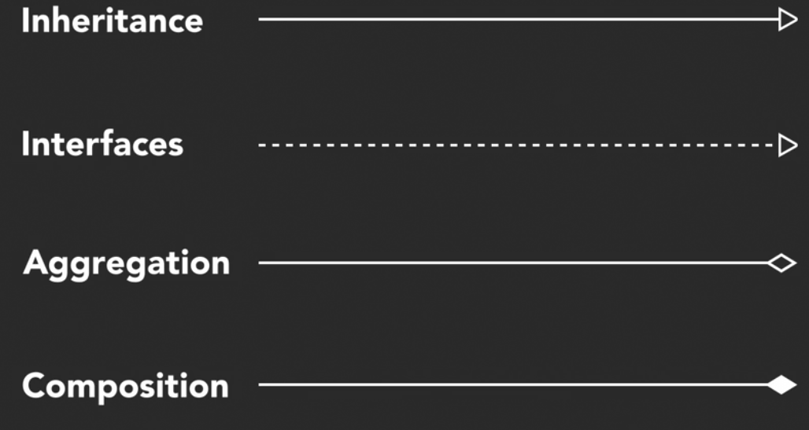  
  
### Jukebox Example  
  
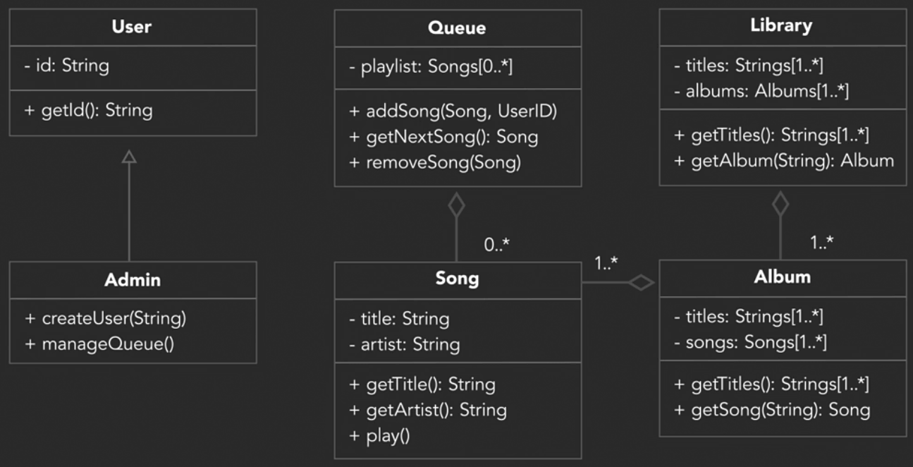  
  
## Object-Oriented Languages  
  
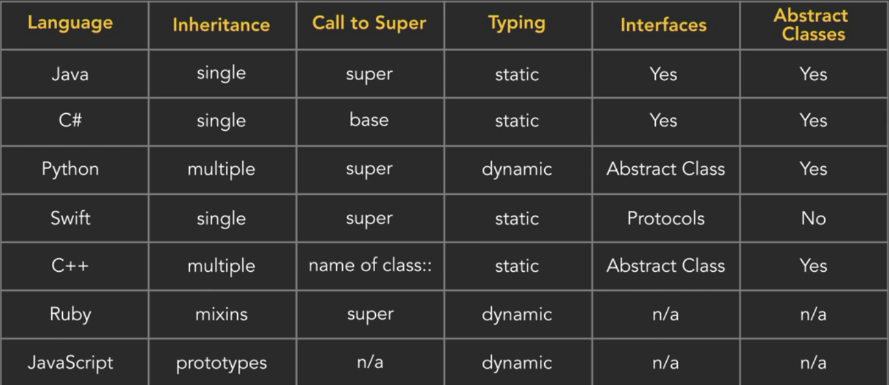  
  
## General Software Development Principles  
  
- **SOLID**  
  - **Single responsibility** principle: A class should have only a single responsibility.  
  - **Open/closed** principle  
  - **Liskov substitution** principle  
  - **Interface segregation** principle  
  - **Dependency inversion** principle  
- **DRY**  
  - Don't Repeat Yourself  
- **YAGNI**  
  - You Ain’t Gonna Need It  
