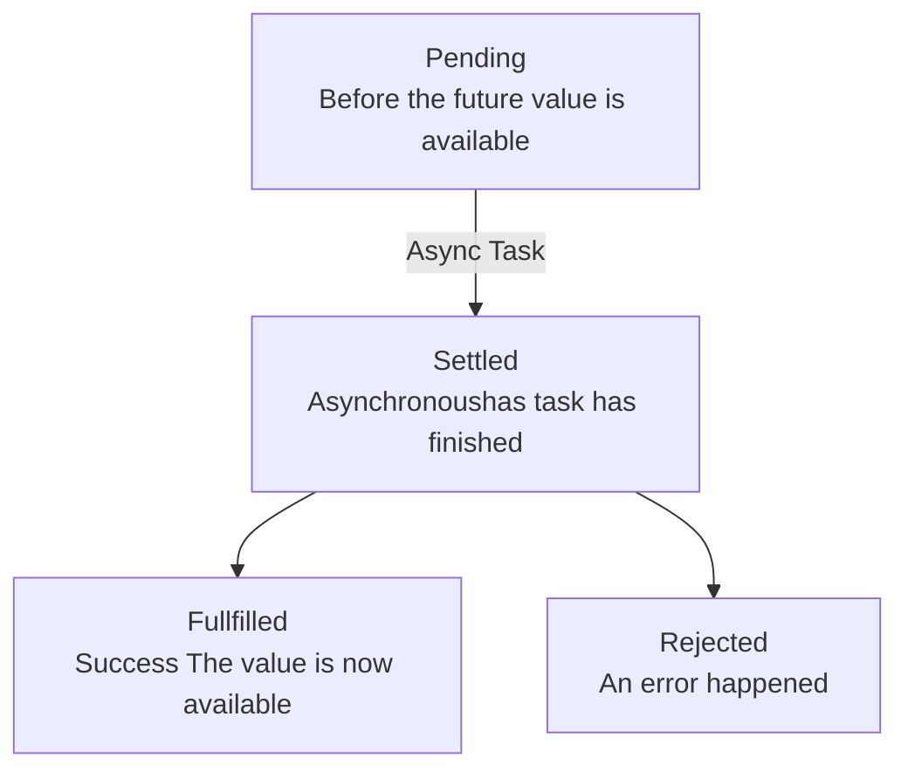
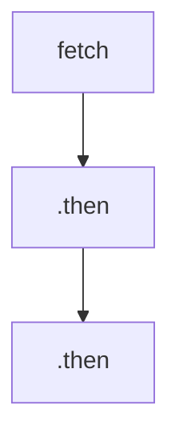

---  
title: JavaScript Asynchronous  
created: 2022-08-07 06:31  
updated: 2022-08-16 09:25  
aliases:  
  - JavaScript Asynchronous  
share: true  
website: en/notes/programming  
tags:  
  - ملاحظة_مؤرشفة  
  - JavaScript  
---  
  
  
  
المعرفة:: [JavaScript](JavaScript)  
الحالة:: #ملاحظة_مؤرشفة  
المراجع:: [The Complete JavaScript Course 2022 From Zero to Expert](The%20Complete%20JavaScript%20Course%202022%20From%20Zero%20to%20Expert), <https://developer.mozilla.org/en-US/docs/Web/API/Fetch_API/Using_Fetch>, <https://javascript.info/promise-chaining>, <https://javascript.info/promise-api>  
  
---  
  
## Synchronous vs Asynchronous  
  
### Synchronous  
  
- Most code is synchronous.  
- Simply means that the code is **executed line by line**, in the exact order of execution that we defined in our code.  
- Each line of code always **waits for the previous** line to finish execution.  
- This can be a problem when **long-running** operations **block code execution**.  
  
```js  
const p = document.querySelector('.p');  
p.textContent = 'My name 1is Jonas!';  
alert('Text set!');  
p.style.color = 'red’;  
```  
  
### Asynchronous  
  
- Asynchronous literally means **not occurring at the same time**.  
- Asynchronous code is **non-blocking**. It runs in the background without preventing the main code from executing.  
- Execution doesn’t wait for an asynchronous task to finish its work.  
- Asynchronous code is executed **after a task that runs in the “background” finishes**.  
- Callback functions / event listeners alone do **NOT** make code asynchronous!  
- In summary, asynchronous programming is all about coordinating the behavior of our program over a certain period of time.  
- Examples: Asynchronous image loading with event and callback, Geolocation API or AJAX calls.  
  
```js  
const p = document.querySelector('.p');  
setTimeout(function () { // Asynchronous  
  p.textContent = 'My name is Jonas!';  
  }, 5000);  
p.style.color = 'red’;  
```  
  
## AJAX  
  
- Asynchronous JavaScript And XML: Allows us to communicate with remote web servers in an **asynchronous way**. With AJAX calls, we can **request data** from web servers dynamically.  
  
## API  
  
- Application Programming Interface: Piece of software that can be used by another piece of software, in order to **allow applications to talk to each other and exchange information.**  
- There are countless types of APIs, e.g. DOM API - Geolocation API - Own Class API (methods available as a public interface) - “Web” API.  
- **“Web” API:** Application running on a server, that receives requests for data, and sends data back as response.  
- We can build our **own web** APIs (requires back-end development, e.g. with node.js) or use **3rd-party** APIs.  
- Most APIs these days use the JSON data format, XML is being less used.  
- There are APIs for everything:  weather data, countries data, flights data, currency conversion, sending email or SMS, Google Maps, etc...  
  
## XMLHttpRequest  
  
- This is the old school way of doing AJAX in JavaScript.  
- To do requests in sequence, we have to implement nested callbacks, which is known as "callback hell".  
  
```js  
const request = new XMLHttpRequest();  
request.open('GET', `https://restcountries.com/v3.1/name/egypt`);  
request.send();  
// Since XMLHttpRequest is async, we can't get request.responseText immediately, so we have to set an event listener to handle response once it's here.  
request.addEventListener('load', function () {  
  const [data] = JSON.parse(this.responseText);  
  console.log(data);  
});  
```  
  
- "callback hell" is a name for that case when we have a lot of nested callbacks in order to execute asynchronous tasks in sequence.  
- The problem with callback hell is that it makes our code look very messy, harder to maintain, and very difficult to understand.  
  
```js  
setTimeout(() => {  
  console.log('1 second passed');  
  setTimeout(() => {  
    console.log('2 seconds passed');  
    setTimeout(() => {  
      console.log('3 second passed');  
      setTimeout(() => {  
        console.log('4 second passed');  
      }, 1000);  
    }, 1000);  
  }, 1000);  
}, 1000);  
```  
  
^callbackHellExample  
  
## Promises  
  
- An object that is used as a **placeholder for the future result** of an asynchronous operation.  
- A container for an asynchronously delivered value.  
- By using promises, we **no longer need to rely on events and callbacks** passed into asynchronous functions to handle asynchronous results.  
- Instead of nesting callbacks, we can **chain promises** for a sequence of asynchronous operations: escaping callback hell.  
- Using a promise to get a result is called "consuming a promise". In order for a promise to exist in the first place, it must be built first.  
  
### The Promise Lifecycle  
  
- Since promises work with asynchronous operations, they change over time and can be in different states, this is what we call the cycle of a promise.  
- We are able handle these different states in our code in order to do something as a result of either a successful promise or a rejected one.  
  
1. In the very **beginning**, we say that a promise is **pending**. This is before any value resulting from the asynchronous task is available. During this time, the asynchronous task is still doing its work in the background.  
2. When the **task finally finishes**, we say that the promise is **settled**. There are **two different types** of settled promises and that's **fulfilled** promises and **rejected** promises.  
   - A **fulfilled** promise is a promise that has **successfully** resulted in a value just as we expect it. To handle this fulfilled state, we can use the `then()` method and pass a **callback function** that we want to be executed as soon as the promise is actually fulfilled.  
   - A **rejected** promise means that **there has been an error** during the asynchronous task.  
   - A promise is **only settled once**, then the state will **remain unchanged** forever.  
   - `finally()` method can be used to do something that always needs to happen no matter the result of the promise, for example, hiding a loading spinner.  
  

  
## Fetch API  
  
- The Fetch API provides a JavaScript interface for accessing and manipulating parts of the HTTP pipeline, such as requests and responses. It also provides a global `fetch()` method that provides an easy, logical way to fetch resources asynchronously across the network. This kind of functionality was previously achieved using `XMLHttpRequest`.  
- The `Response` object, does not directly contain the actual JSON response body but is instead a representation of the entire HTTP response. So, to extract the JSON body content from the `Response` object, we use the `json()` method, which returns a second promise that resolves with the result of parsing the response body text as JSON.  
  
```js  
// const request = new XMLHttpRequest();  
// request.open('GET', `https://restcountries.com/v3.1/name/egypt`);  
// request.send();  
  
// Fetch returns promises  
const req = fetch('https://restcountries.com/v3.1/name/egypt')  
console.log(req) // A promise  
  
// Fullfilled promises can be handled using .then()  
fetch('https://restcountries.com/v3.1/name/egypt').then((response) => console.log(response)) // A Response object  
  
// Get JSON  
fetch('https://restcountries.com/v3.1/name/egypt').then((response) => response.json())  
  .then((data) => console.log(data));  
```  
  
## Chaining Promises  
  
- The idea is that the result is passed through the chain of `.then` handlers.  
- The whole thing works because every call to a `.then` returns a new promise, so that we can call the next `.then` on it.  
- When a handler returns a value, it becomes the result of that promise, so the next `.then` is called with it.  
  

  
```js  
const getCountryData = function (country) {  
  // Country 1  
  fetch(`https://restcountries.com/v3.1/name/${country}`)  
    .then(response => response.json())  
    .then(data => {  
      renderCountry(data[0]);  
      const neighbour = data[0].borders[0];  
      if (!neighbour) return;  
      // Country 2  
      return fetch(`https://restcountries.com/v3.1/alpha/${neighbour}`);  
    })  
    .then(response => response.json())  
    .then(data => renderCountry(data, "neighbour"));  
  getCountryData("portugal");  
};  
```  
  
## Handling Promise Rejection  
  
There are two ways of handling rejections:  
  
- The first one is to **pass a second callback** function into the `then()` method.  
  
```js  
fetch(`https://restcountries.com/v3.1/name/${country}`).then(  
  response => response.json(), err => alert(err)  
);  
```  
  
- The second is to add **a callback function to catch method at the end of the chain**, that will handle errors globally.  
  
```js  
fetch(...).then(response => response.json()).then(data => console.log(data)).catch(err => alert(err));  
```  
  
## Throwing Errors Manually  
  
- In some cases, just depending on rejected promises isn't enough to catch errors. For example, when a fetch response is 404 or any not `ok` code.  
- To handle this, we need to throw a new error manually, by creating a new `Error` object and `throw` it, which will immediately terminate the current function and return a rejected promise.  
  
```js  
fetch(`https://restcountries.com/v3.1/alpha/asdfa`).then(response => {  
  if (!response.ok)  
    throw new Error(`Country not found (${response.status})`);  
  
  return response.json();  
});  
```  
  
- Instead of handling each chained promise by having duplicate code, we can create and use a small helper function.  
  
```js  
const getJSON = function (url, errorMsg = 'Something went wrong') {  
  return fetch(url).then(response => {  
    if (!response.ok) throw new Error(`${errorMsg} (${response.status})`);  
  
    return response.json();  
  });  
};  
  
const getCountryData = function (country) {  
  // Country 1  
  getJSON(  
    `https://restcountries.com/v3.1/name/${country}`,  
    'Country not found'  
  )  
    .then(data => {  
      renderCountry(data[0]);  
      const neighbour = data[0].borders[0];  
  
      if (!neighbour) throw new Error('No neighbour found!');  
  
      // Country 2  
      return getJSON(  
        `https://restcountries.com/v3.1/alpha/${neighbour}`,  
        'Country not found'  
      );  
    })  
  
    .then(data => {  
      [data] = data;  
      renderCountry(data, 'neighbour')  
    })  
    .catch(err => {  
      console.error(`${err} 💥💥💥`);  
      renderError(`Something went wrong 💥💥 ${err.message}. Try again!`);  
    })  
    .finally(() => {  
      countriesContainer.style.opacity = 1;  
    });  
};  
```  
  
## How Asynchronous works?  
  
### Introduction  
  
Previously, we learnt that:  
  
- A [JavaScript Runtime](,%20JavaScript%20Engine#JavaScript%20Runtime.md) is basically a container which includes all the different pieces that are necessary to execute JavaScript code.  
  - The heart of every JavaScript runtime is the [engine](./JavaScript%20Engine.md), where **code** is actually **executed** and where **objects are stored in memory**.  
    - These two things happen in the **call stack** and in the **heap**.  
  - The Runtime also includes **Web APIs** environment (DOM, timers, fetch, geolocation, etc.).  
  - Another component of the runtime is the **Callback Queue**, a data structure that holds all ready to be executed callback functions that are attached to some event that has occurred.  
    - Whenever the call stack is empty **The Event Loop** takes callbacks from the callback queue and puts them into call stack so that they can be executed. So, the event loop is the essential piece that makes asynchronous behavior possible in JavaScript.  
- JavaScript has only **one thread of execution**, there's no multitasking happening in JavaScript itself, unlike other languages like Java.  
  
Remember that one of JavaScript features is the non-blocking event loop:  
  
  
  
- JavaScript has a non blocking concurrency model.  
- A concurrency model is simply how a language handles multiple things happening at the same time.  
  
### How Asynchronous JavaScript Works Behind the Scenes?  
  
How can **asynchronous** code be executed in a **non-blocking way**, if there is **only one thread** of execution in the engine?  
  
- Asynchronous tasks of DOM, timers, AJAX, etc. will all run in the web API environment of the browser.  
  
- Example 1: Setting `.src` attribute of an image is being done asynchronously, if the image would be loading in **a synchronous way**, it would be doing so in the call stack **blocking the execution** of the rest of the code.  
  - If we want to do something after the image has finished loading, then we need to **listen to the load event**. This means to **register this callback** in the web APIs environment, exactly where the image is loading, and the callback will stay there until the load event is emitted. (Handling asynchronous behavior here with a callback).  
  - Once the image has finished loading and the load event is emitted, the callback for this event is put into **callback queue** (an ordered list of all the callback functions that are in line to be executed).  
  
- Example 2: AJAX call using `fetch` will also happen in the web APIs environment. Using the `then()` method on the promise returned by `fetch` will also **register a callback** in the web API environment so that we can react to the future resolved value of the promise.  
  
  
## The Event Loop  
  
The event loop concept is very simple. There’s an endless loop, where the JavaScript engine waits for tasks, executes them and then sleeps, waiting for more tasks.  
  
- The Event Loop looks into the call stack and determines whether it's empty or not, except for the global context, then if the stack is empty which means that there's currently no code being executed it will take the first callback from the callback queue and put it on the call stack two will be executed **(Event Loop Tick)**.  
  
- The event loop has the extremely important task of doing **coordination between the call stack and callbacks in the callback queue**.  
  
- The Event Loop is basically who decides exactly when each callback is executed. We can also say that **the event loop does the orchestration of this entire JavaScript runtime**.  
  
### Event Loop and Promises  
  
- With **promises** things work in a slightly different, callbacks related to promises doesn't go into the callback queue, instead, they **have a special queue** for themselves, which is the so called **micro tasks queue**.  
  
- **Micro tasks queue has priority over the callback queue**.  
  
- **At the end of an event loop tick** after a callback has been taken from the callback queue, **the event loop will check if there are any callbacks in the micro tasks queue**, if there are any, it will **run** all of them **before** it will run any more callbacks from the **regular callback queue**.  
  
- Micro tasks queue can starve the callback queue, because if we keep adding more micro tasks, then callbacks in the callback queue can never execute. This is usually never a problem but it's possible.  
  
### Event Loop in Practice  
  
```js  
console.log('Test start');  
setTimeout(() => console.log('0 sec timer'), 0);  
Promise.resolve('Resolved promise 1').then(res => console.log(res));  
Promise.resolve('Resolved promise 2').then(res => {  
  for (let i = 0; i < 1000000000; i++) {}  
  console.log(res);  
});  
console.log('Test end');  
// output  
// 1. Code outside of a callback will run first, from top to botton.  
// Test start  
// Test end  
// 2. Both timer and promise will finish at the exact same time,  
// Resolved promise 1 // but since Promise is put in micro tasks queue, it will be handled first.  
// Resolved promise 2 // Promise 2 is shown after than, even though it takes a lot of time due to heavy computing task.  
// 0 sec timer // finally, code from regular callback queue is executed.  
```  
  
## Building Promises  
  
- The Promise constructor is primarily used to wrap functions that do not already support promises.  
- It takes on argument, the executor function, which takes two arguments, resolve and reject functions.  
- To create a new Promise: `const promise1 = new Promise(function(resolve, reject) {function body}`.  
- In `resolve()` function, we pass the fulfilled value of the promise that will be later consumed using `then()` method.  
- In `reject()` function, we pass the error message that will be used later using `catch()` method.  
- To consume it: `promise1.then((value) => { console.log(value) });`  
  
Example:  
  
```js  
// Build a Simple Promise  
const guessPromise = new Promise(function (resolve, reject) {  
  console.log('Guess draw is happening');  
  setTimeout(function () {  
    if (Math.floor(Math.random() * 10) + 1 >= 5) {  
      resolve('You Won!');  
    } else {  
      // reject('You lost!');  
      reject(new Error('You lost!'));  
    }  
  }, 2000);  
});  
  
// Consume the Promise  
guessPromise.then(res => console.log(res)).catch(err => console.error(err));  
```  
  
### Promisifying  
  
- Usually we build promises to wrap old callback based functions into promises, this is a process that we call **Promisifying**.  
- Promisifying means to **convert callback based asynchronous behavior to promise based**.  
- To do this, usually we create a function, then inside of this function we create and return the promise.  
  
#### Example 1  
  
```js  
// Promisifying setTimeout  
const wait = function (seconds) {  
  // We don't need the reject function because it's actually impossible for the timer to fail.  
  return new Promise(function (resolve) {  
  // We also are not going to pass any resolved value into the resolve function because that's actually not mandatory.  
    setTimeout(resolve, seconds * 1000); // setTimeout needs time in milliseconds  
  });  
};  
  
const waitA = (seconds) => new Promise((resolve) => setTimeout(resolve, seconds * 1000));  
  
waitA(2).then(() => console.log('2 second passed from calling waitA'));  
  
wait(1)  
  .then(() => {  
    console.log('1 second passed');  
    return wait(1); // return a new promise to chain calling  
  })  
  .then(() => {  
    console.log('2 second passed');  
    return wait(1);  
  })  
  .then(() => {  
    console.log('3 second passed');  
    return wait(1);  
  })  
  .then(() => console.log('4 second passed'));  
  
// 1 second passed  
// 2 second passed from calling waitA  
// 2 second passed  
// 3 second passed  
// 4 second passed  
```  
  
- In the previous example, having a nice sequence of asynchronous behavior is way better than callback hell example.  
  
  
  
#### Example 2  
  
Remember that `navigator.geolocation.getCurrentPosition()`  So we don't need to pass `resolve` and `reject` manually.  
  
```js  
// Promisifying the Geolocation API  
const getPosition = function () {  
  return new Promise(function (resolve, reject) {  
    // navigator.geolocation.getCurrentPosition(  
    //   position => resolve(position),  
    //   err => reject(err)  
    // );  
    navigator.geolocation.getCurrentPosition(resolve, reject);  
  });  
};  
getPosition().then(pos => console.log(pos));  
```  
  
#### Example 3  
  
```js  
const imgContainer = document.querySelector('.images');  
const wait = (seconds) => new Promise((resolve) => setTimeout(resolve, seconds * 1000));  
  
// Promisifying img loading  
const createImage = function (imgPath) {  
  return new Promise(function (resolve, reject) {  
    const img = document.createElement('img');  
    img.src = imgPath;  
  
    img.addEventListener('load', function () {  
      imgContainer.append(img);  
      resolve(img);  
    });  
  
    img.addEventListener('error', function () {  
      reject(new Error('Image not found'));  
    });  
  });  
};  
  
// Show image for two seconds, then hide it and show a second image for two seconds as well, then hide it.  
  
let currentImg;  
  
createImage('img/img-1.jpg')  
  .then(img => {  
    currentImg = img;  
    console.log('Image 1 loaded');  
    return wait(2);  
  })  
  .then(() => {  
    currentImg.style.display = 'none';  
    return createImage('img/img-2.jpg');  
  })  
  .then(img => {  
    currentImg = img;  
    console.log('Image 2 loaded');  
    return wait(2);  
  })  
  .then(() => {  
    currentImg.style.display = 'none';  
  })  
  .catch(err => console.error(err));  
```  
  
### Creating an immediately fulfilled or a rejected promise  
  
- To create an immediately fulfilled promise we can use `Promise.resolve()` static method of the promise constructor and pass in the resolved value.  
- We can also do the same with `Promise.reject()`.  
  
```js  
Promise.resolve('abc').then(x => console.log(x)); // abc  
Promise.reject('abc').catch(x => console.error(x)); // abc  
Promise.reject(new Error('Problem!')).catch(x => console.error(x)); // Error: Problem!  
```  
  
## Consuming Promises with `async` and `await`  
  
- Since ES2017, there is now a **better and easier way to consume promises**, which is called `async` `await`.  
- An `async` function is **a special kind of function** that will basically **keeps running in the background while performing the code that inside of it**, then when it is done, it will **automatically return a promise**.  
- Inside an `async` function, we can have one or more `await` statements. `await` will stop the code execution at this point of the function until the premise is fulfilled.  
- Stopping the code inside an `async` function isn't a problem because the function is running asynchronously in the background and therefore it is **not blocking the main thread of execution**.  
- `async` and `await` makes our code **look like regular synchronous code** while behind the scenes everything is in fact asynchronous, that makes it so much **easier and more clean**. We now are able to store the fulfilled promise value immediately into a variable without having to mess with callback functions.  
  
```js  
async function whereAmI(country) {  
  // fetch(`https://restcountries.com/v3.1/name/${country}`).then(res => console.log(res)) // old way  
  const res = await fetch(`https://restcountries.com/v3.1/name/${country}`);  
  console.log(res);  
}  
whereAmI("Egypt");  
console.log("1");  
  
// output  
// 1  
// [object Response]  
```  
  
Full example:  
  
```js  
const getPosition = function () {  
  return new Promise(function (resolve, reject) {  
    navigator.geolocation.getCurrentPosition(resolve, reject);  
  });  
};  
  
const whereAmI = async function() {  
  // Geolocation  
  const pos = await getPosition();  
  const {  
    latitude: lat,  
    longitude: lng  
  } = pos.coords;  
  
  // Reverse geocoding  
  const resGeo = await fetch(`https://geocode.xyz/${lat},${lng}?geoit=json`);  
  const dataGeo = await resGeo.json();  
  console.log(dataGeo);  
  
  // Country data  
  const res = await fetch(  
    `https://restcountries.com/v3.1/alpha/${dataGeo.prov}`  
  );  
  const data = await res.json();  
  console.log(data);  
  renderCountry(data[0]);  
};  
  
whereAmI();  
```  
  
## Error Handling with `async` and `await`  
  
- With `async`/`await`, we can't use the `catch()` method that we use before, but we can use a `try` `catch` statement.  
  
```js  
const whereAmI = async function () {  
  try {  
    // Geolocation  
    const pos = await getPosition();  
    const { latitude: lat, longitude: lng } = pos.coords;  
  
    // Reverse geocoding  
    const resGeo = await fetch(`https://geocode.xyz/${lat},${lng}?geoit=json`);  
    if (!resGeo.ok) throw new Error('Problem getting location data');  
    const dataGeo = await resGeo.json();  
    console.log(dataGeo);  
  
    // Country data  
    const res = await fetch(  
      `https://restcountries.com/v3.1/alpha/${dataGeo.prov}`  
    );  
    if (!res.ok) throw new Error('Problem getting country');  
    const data = await res.json();  
    console.log(data);  
    renderCountry(data[0]);  
  } catch (err) {  
    console.error(`${err} 💥`);  
    renderError(`💥 ${err.message}`);  
  }  
};  
```  
  
## Returning Values from async Functions  
  
- `async` functions return a `Promise`.  
- The returned promise can be consumed normally using `then()` method.  
- In case of errors happening inside `try` block, the promise won't be rejected. To fix this the error caught in `catch` block must be re-thrown `throw err;`.  
- `finally()` will be executed always.  
  
```js  
whereAmI()  
  .then(city => console.log(`2: ${city}`))  
  .catch(err => console.error(`2: ${err.message} 💥`))  
  .finally(() => console.log('3: Finished getting location'));  
```  
  
- [IIFE's](JavaScript%20Immediately%20Invoked%20Function%20Expressions%20IIFE) can be utilized to use `await` and receive data from other async functions instead of having to reply on Promise's `then()`, `catch()` and `finally()`.  
  
```js  
async function () {  
  try {  
    const city = await whereAmI();  
    console.log(`2: ${city}`);  
  } catch (err) {  
    console.error(`2: ${err.message} 💥`);  
  }  
  console.log('3: Finished getting location');  
})();  
```  
  
## Promise Combinator Functions  
  
### Running Promises in Parallel with Promise.all()  
  
- `Promise.all(promises)` takes an iterable of promises, waits for all promises to resolve and returns an array of their results. If any of the given promises is rejected, it becomes the error of `Promise.all`, and all other results are ignored.  
  
```js  
const get3Countries = async function (c1, c2, c3) {  
  try {  
    // The commented code runs in sequence not in parallel  
    // const [data1] = await getJSON(  
    //   `https://restcountries.com/v3.1/name/${c1}`  
    // );  
    // const [data2] = await getJSON(  
    //   `https://restcountries.com/v3.1/name/${c2}`  
    // );  
    // const [data3] = await getJSON(  
    //   `https://restcountries.com/v3.1/name/${c3}`  
    // );  
    // console.log([data1.capital, data2.capital, data3.capital]);  
  
    const data = await Promise.all([  
      getJSON(`https://restcountries.com/v3.1/name/${c1}`),  
      getJSON(`https://restcountries.com/v3.1/name/${c2}`),  
      getJSON(`https://restcountries.com/v3.1/name/${c3}`),  
    ]);  
    console.log(data.map(d => d[0].capital)); // ["City1", "City2", "City3"]  
  } catch (err) {  
    console.error(err);  
  }  
};  
get3Countries('portugal', 'canada', 'tanzania');  
```  
  
### Promise.race()  
  
- `Promise.race(promises)` waits for the first promise to settle, and its result/error becomes the outcome promise. It's similar to `Promise.all`, but waits only for the first settled promise and gets its result (or error).  
  
```js  
// Promise.race  
(async function () {  
  const res = await Promise.race([  
    getJSON(`https://restcountries.com/v3.1/name/italy`),  
    getJSON(`https://restcountries.com/v3.1/name/egypt`),  
    getJSON(`https://restcountries.com/v3.1/name/mexico`),  
  ]);  
  console.log(res[0]);  
})();  
```  
  
- In the real world `Promise.race()` is very useful to prevent against never ending promises or very long running promises. For example, if the user has a very bad internet connection, then a fetch requests in your application might take way too long to actually be useful, so we can create a special time out promise, which automatically rejects after a certain time has passed.  
  
```js  
  
const timeout = function (sec) {  
  return new Promise(function (_, reject) {  
    setTimeout(function () {  
      reject(new Error('Request took too long!'));  
    }, sec * 1000);  
  });  
};  
  
Promise.race([  
  getJSON(`https://restcountries.com/v3.1/name/tanzania`),  
  timeout(5),  
])  
  .then(res => console.log(res[0]))  
  .catch(err => console.error(err));  
```  
  
### Promise.allSettled()  
  
- Introduced in ES2020, `Promise.allSettled(promises)` waits for **all** promises to settle and returns their results as an array of objects with: `status`: "fulfilled" or "rejected" and `value` (if fulfilled) `{status:"fulfilled", value:result}` or reason (if rejected) `{status:"rejected", reason:error}`.  
- It's good for “all or nothing” cases, when we need **all** results successful to proceed.  
  
```js  
// Promise.allSettled  
Promise.allSettled([  
  Promise.resolve('Success'),  
  Promise.reject('ERROR'),  
  Promise.resolve('Another success'),  
]).then(res => console.log(res));  
```  
  
### Promise.any()  
  
- `Promise.any(promises)`, added in ES2021, waits for the first promise to fulfill, and its result becomes the outcome. If all of the given promises are rejected, `AggregateError` becomes the error of `Promise.any`.  
  
```js  
// Promise.any [ES2021]  
Promise.any([  
  Promise.resolve('Success'),  
  Promise.reject('ERROR'),  
  Promise.resolve('Another success'),  
])  
  .then(res => console.log(res))  
  .catch(err => console.error(err));  
```  
  
## Top-Level await  
  
- Starting from ES2022 version, we can now use the `await` keyword outside of `async` functions, at least in [modules](./JavaScript%20Modules.md) (`<script type="module">`).  
  
```js  
// Top-Level Await (ES2022)  
console.log('Start fetching');  
const res = await fetch('https://jsonplaceholder.typicode.com/posts');  
const data = await res.json();  
console.log(data);  
```  
  
- While this is all great and very useful, this actually **blocks the execution of the entire module now**.  
- If one module imports a module which has a top-level `await`, then the importing module will wait for the imported module to finish the blocking code.  
